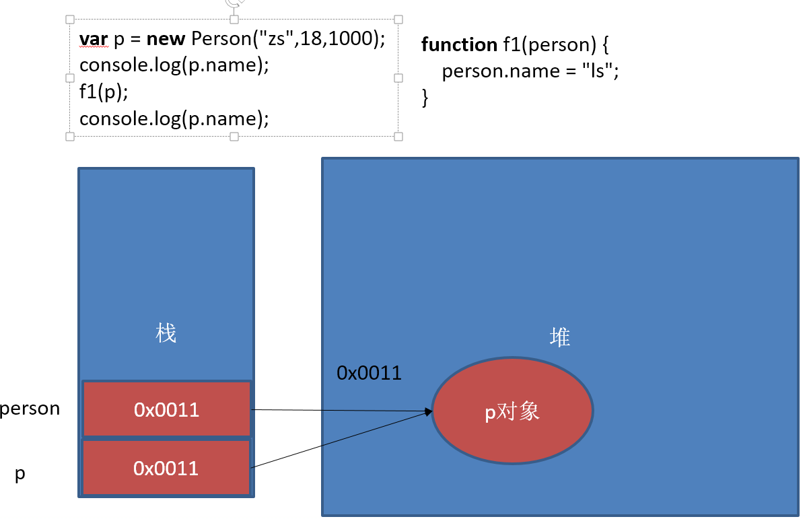

ctrl+/：选中代码全部注释掉

ctrl+左键：转到函数定义

API：方法，工具

编程思想：将生活中做事的经验融入到程序中

1、面向过程：凡事都要亲力亲为，每件事的具体过程都要知道，注重的是过程。

2、面向对象：根据需求找对象，所有的事都用对象来做，注重的是结果。

面向对象特性：封装，继承，多态

封装：即包装，把一些重用的内容进行包装，在需要的时候直接使用

把一个值，存放在一个变量中，把一些重用的代码放在函数中，把好多相同功能的函数放在一个对象中，把好多功能的对象，放在一个文件中，把一些相同的内容放在一个对象中

继承：类与类之间的关系，js中没有类的概念，但是有构造函数的概念，是可以有继承的

多态：同一个行为，针对不同的对象产生不同的效果

js不是面向对象的语言，而是一门基于对象的语言，但是可以模拟面向对象的思想

1. 

##浏览器说明
浏览器是指可以显示网页服务器或者文件系统的HTML文件内容，并让用户与这些文件交互的一种软件。
通俗的讲:可以显示页面的一个软件,
常用的五大浏览器：chrome，firefox，Safari，ie，opera


## 网页、网站和应用程序

网页：单独的一个页面
网站：一些列相关的页面组成到一起
应用程序：可以和用户产生交互，并实现某种功能。

## 演示JavaScript的强大

http://impress.github.io/impress.js/
http://naotu.baidu.com/ 
https://codecombat.com/
https://ide.codemao.cn/

需要翻墙
https://developers.google.com/blockly/
blockly迷宫
https://blockly-games.appspot.com

blockly迷宫不需要翻墙
https://blockly.uieee.com/

## JavaScript介绍

### JavaScript是什么

HTML CSS 

JavaScript 编程语言   流程控制

Netscape在最初将其脚本语言命名为LiveScript，后来Netscape在与Sun合作之后将其改名为JavaScript。JavaScript最初受Java启发而开始设计的，目的之一就是“看上去像Java”，因此语法上有类似之处，一些名称和命名规范也借自Java。JavaScript与Java名称上的近似，是当时Netscape为了营销考虑与Sun微系统达成协议的结果。Java和JavaScript的关系就像张雨和张雨生的关系，只是名字很像。

​	Java  服务器端的编程语言

​	JavaScript  运行在客户端(浏览器)的编程语言

> JavaScript是一种运行在***客户端*** 的***脚本语言*** 
> JavaScript的解释器被称为JavaScript引擎，为浏览器的一部分，广泛用于客户端的脚本语言，最早是在HTML（标准通用标记语言下的一个应用）网页上使用，用来给HTML网页增加动态功能。


### JavaScript最初的目的

演示：http://baixiu.uieee.com/admin/login.php
最初的目的是为了处理表单的验证操作。

### JavaScript现在的意义(应用场景)

JavaScript 发展到现在几乎无所不能。

1. 网页特效
2. 服务端开发(Node.js)
3. 命令行工具(Node.js)
4. 桌面程序(Electron)
5. App(Cordova)
6. 控制硬件-物联网(Ruff)
7. 游戏开发(cocos2d-js)

### JavaScript和HTML、CSS的区别

1. HTML：提供网页的结构，提供网页中的内容
2. CSS: 用来美化网页
3. JavaScript: 可以用来控制网页内容，给网页增加动态的效果

##### JavaScript的组成

###### ECMAScript标准

​	ECMA 欧洲计算机制造联合会

​	网景：JavaScript

​	微软：JScript

​	定义了JavaScript的语法规范  

**JavaScript的核心**，描述了js语言的基本语法和数据类型，ECMAScript是一套标准，定义了一种语言的标准与具体实现无关

###### BOM - 浏览器对象模型

​	一套操作浏览器功能的API

​	通过BOM可以操作浏览器窗口，比如：弹出框、控制浏览器跳转、获取分辨率等

###### DOM - 文档对象模型

​	一套操作页面元素的API

​	DOM可以把HTML看做是文档树，通过DOM提供的API可以对树上的节点进行操作

##### JavaScript的书写位置 

- ###### 写在行内

```html
<input type="button" value="按钮" onclick="alert('Hello World')" />
```

- ###### 写在script标签中

```html
<head>
  <script>
    alert('Hello World!');
  </script>
</head>
```

- ###### 写在外部js文件中，在页面引入

```html
<script src="main.js"></script>
```

***		引用外部js文件的script标签中不可以写JavaScript代码***

#### 变量

##### 	什么是变量

​	变量是计算机内存中存储数据的标识符，根据变量名称可以获取到内存中存储的数据


##### 	变量的命名规则和规范

- 规则 - 必须遵守的，不遵守会报错

  - 由字母、数字、下划线、$符号组成，不能以数字开头

  - 不能是关键字和保留字，例如：for、while。

  - 区分大小写

- 规范 - 建议遵守的，不遵守不会报错

  - 变量名必须有意义
  - 遵守**驼峰命名法**。首字母小写，后面单词的首字母需要大写。例如：userName、userPassword

  ctrl+alt+l     格式化代码


#### 数据类型

##### 简单数据类型

Number、String、Boolean、Null、Undefined、

###### Number类型

- 数值字面量：数值的固定值的表示法

  110 1024  60.5

- 进制

```
十进制
	var num = 9;
	进行算数计算时，八进制和十六进制表示的数值最终都将被转换成十进制数值。
十六进制
	var num = 0xA;
	数字序列范围：0~9以及A~F
八进制
    var num1 = 07;   // 对应十进制的7
    var num2 = 019;  // 对应十进制的19
    var num3 = 08;   // 对应十进制的8
    数字序列范围：0~7
    如果字面值中的数值超出了范围，那么前导零将被忽略，后面的数值将被当作十进制数值解析
```

- 浮点数

  - 浮点数的精度问题

```
浮点数
	var n = 5e-324;   // 科学计数法  5乘以10的-324次方  
浮点数值的最高精度是 17 位小数，但在进行算术计算时其精确度远远不如整数
   var result = 0.1 + 0.2;    // 结果不是 0.3，而是：0.30000000000000004
   console.log(0.07 * 100);
   不要判断两个浮点数是否相等
```

- 数值范围

```
最小值：Number.MIN_VALUE，这个值为： 5e-324
最大值：Number.MAX_VALUE，这个值为： 1.7976931348623157e+308
无穷大：Infinity
无穷小：-Infinity
```

- 数值判断

  - NaN：not a number

    - NaN 与任何值都不相等，包括他本身

  - isNaN: is not a number(不是一个数字吗？不是：true，是：false)

    不要用NaN判断是不是NaN，应使用isNaN(值或变量)

  数字类型:number类型
  ​    * 无论是整数还是小数都是数字类型
  ​        * 不要用小数验证小数
  ​        * 不要使用NaN判断是不是NaN，应该使用isNaN(值或者是变量)
  ​        * 想要表示十进制:就是正常的数字
  ​        * 想要表示八进制:以0开头
  ​        * 想要表示十六进制:0x开头


###### String类型

'abc'   "abc"

- 转义符

- 字符串长度

  length属性用来获取字符串的长度

  ```javascript
  var str = '黑马程序猿 Hello World';
  console.log(str.length);
  ```

- 字符串拼接

  字符串拼接使用 + 连接

  ```javascript
  console.log(11 + 11);
  console.log('hello' + ' world');
  console.log('100' + '100');
  console.log('11' + 11);
  console.log('male:' + true);
  ```

  1. 两边只要有一个是字符串，那么+就是字符串拼接功能，除此外别的运算符会发生计算

     （浏览器帮助我们自动的把字符串类型转成了数字类型,这种方式叫:隐式转换）

  2. 两边如果都是数字，那么就是算术功能。

###### Boolean类型

- Boolean字面量：  true和false，区分大小写
- 计算机内部存储：true为1，false为0

##### Undefined和Null区别

1. undefined表示一个声明了**没有赋值**的变量，变量只声明的时候值默认是undefined

   函数没有明确返回值，如果接受了，结果也是undefined

   一个变量的结果是undefinted和一个数字进行计算结果为NaN(not a number)

2. null表示赋值了，但**值为空null**，变量的值如果想为null，必须手动设置

   当一个变量赋值为null时，指的是该变量里存储的是一个对象

```javascript
var a = null
// a指向一个对象，但对象此时还没有确定
```

```javascript
console.log(null == undefined)	// true
console.log(null === undefined) //false
```

#### JS引擎如何管理内存

1. 内存生命周期
   1. 分配需要的内存
   2. 使用分配到的内存
   3. 不需要时将其释放


2. 如何释放内存？

>  1. 为执行函数分配的栈空间内存，函数执行完自动释放
>
>  2. 存储对象的堆空间的内存：当内存没有引用指向是，对象成为垃圾对象，垃圾回收器就会回收
>
>  让要释放的目标对象成为一个垃圾对象，该对象身上没有任何的引用指向（null）
>
>  想让某一个对象成为垃圾对象被回收，可以让指向该对象的变量指向null

```javascript
var obj = {name: '233'}
obj = null
```


### 数据类型检测

**typeof**：返回数据类型的 *字符串* 形式

> 适合基本类型及function检测，遇到null失效
>
> **不能区分 null 与对象**

```javascript
typeof 100 		//"number"
typeof true		//"boolean"
typeof function		//"function"
typeof(undefinted)		//"undefinted"
typeof NaN		//"number"

typeof new Object()		//"object"
typeof [1,2]		//"object"
typeof null		//"object"
```

**instanceof**

判断左边操作数对象的原型链上是否有右边构造函数的prototype属性

> 适合检测自定义对象，也可用来检测原生对象
>
> 专用来判断： Object、Array、Function 
>
> 可以判断 undefined 和 null

```javascript
[1,2] instanceof Array === true
new Object() instanceof Array === false
```

**Object.prototype.toString**

> 适合检测内置对象，遇到null和undefinted失效

```javascript
Object.prototype.toString.apply([]);==="[object Array]";
Object.prototype.toString.apply(function(){});==="[object Function]"
Object.prototype.toString.apply(null);==="[object Null]";
Object.prototype.toString.apply(undefinted);==="[object Undefinted]"
```

**constructor**

**duck type**

##### 

##### 字面量

在源代码中一个固定值的表示法。

数值字面量：8, 9, 10

字符串字面量：'黑马程序员', "大前端"

布尔字面量：true，false


#### 数据类型转换

​	如何使用谷歌浏览器，快速的查看数据类型？

​	字符串的颜色是黑色的，数值类型、bool蓝色的，undefined和null是灰色的

##### 转换成字符串类型

- ###### .toString()

  ```
  var num = 5;
  console.log(num.toString());
  ```

- ###### String()

  ```
  String()函数存在的意义：有些值没有toString()，这个时候可以使用String()。比如：undefined和null
  ```

  //如果变量有意义调用，使用.toString()转换

  //没有意义（变量未赋值或为null），使用String()转换

- 拼接字符串方式

  num  +  ""，当 + 两边一个操作符是字符串类型，一个操作符是其它类型的时候，会先把其它类型转换成字符串再进行字符串拼接，返回字符串

##### 转换成数值类型:三种方式

- ###### Number()  //转数字（整数或小数）

  ```
  Number()可以把转换成数值，如果要转换的字符串中有一个不是数值的字符，返回NaN
  ```

- ###### parseInt()  //转整数

  ```javascript
  var num1 = parseInt("12.3abc");  // 返回12，如果第一个字符是数字会解析直到遇到非数字结束
  var num2 = parseInt("abc123");   // 返回NaN，如果第一个字符不是数字或者符号就返回NaN
  ```

- ###### parseFloat()

  ```
  parseFloat()把字符串转换成浮点数
  parseFloat()和parseInt非常相似，不同之处在与
  	parseFloat会解析第一个. 遇到第二个.或者非数字结束
  	如果解析的内容里只有整数，解析成整数
  ```

- +，-0等运算

  ```javascript
  var str = '500';
  console.log(+str);		// 取正
  console.log(-str);		// 取负
  console.log(str - 0);
  ```

##### 转换成布尔类型

- Boolean()

0  、''(空字符串)、 null、 undefined 、NaN 、会**转换成false**  其它都会转换成true

### 运算符（操作符）

运算符  operator  

字面量：把一个值直接赋值给一个变量（如：var num=10; var abc=true）

###### 算术运算符

```
+ - * / %  
```

###### 一元运算符

只有一个操作数的运算符

++  自身加1

-- 自身减1

- 前置++：先自身加1，后参与运算

  ```javascript
  var num1 = 5;
  ++ num1; 
  
  var num2 = 6;
  console.log(num1 + ++ num2);
  ```

- 后置++：先参与运算，运算结束后加1

  ```javascript
  var num1 = 5;
  num1 ++;    
  var num2 = 6 
  console.log(num1 + num2 ++);
  
  var num=10;
  var sum=num++ +10;   //=20
  ```

- 猜猜看

  ```javascript
  var a = 1; var b = ++a + ++a; console.log(b);    //5
  var a = 1; var b = a++ + ++a; console.log(b);    //
  var a = 1; var b = a++ + a++; console.log(b); 
  //b=1+a++;b=1+ 2++;(i=2); b=1+2 ++ ; b=3 (i=3)
  var a = 1; var b = ++a + a++; console.log(b);  
  ```
  ##### 二元运算符

  ##### 两个操作数的运算符 

###### 逻辑运算符(布尔运算符)
	&& 与 两个操作数同时为true，结果为true，否则都是false
	|| 或 两个操作数有一个为true，结果为true，否则为false
	!  非  取反

###### 关系运算符(比较运算符)
	<  >  >=  <= == != === !==
```javascript
==与===的区别：==只进行值得比较，===类型和值同时相等，则相等（结果为bool类型）

var result = '55' == 55;  	// true
var result = '55' === 55; 	// false 值相等，类型不相等
var result = 55 === 55; 	// true
```

###### 赋值运算符

=   +=   -=   *=   /=   %=

```javascript
例如：
var num = 0;
num += 5;	//相当于  num = num + 5;
```

###### delete运算符

```javascript
var obj = {x: 1}
obj.x		//1
delete obj.x	
obj.x		//undefined

//configurable: false 为true时该对象才能进行删除操作
var obj{}
Object.defineProperty(obj,'x',{
    configurable: false,
    value: 1
})
delete obj.x		//false
obj.x		//1
```

###### in 运算符

```javascript
window.x = 1
'x' in window		//true

//in 会在原型链上向上查找
var cat = new Object
'toString' in cat 	//true

//判断是否可枚举
cat.propertyIsEmumerable('legs')	//true
cat.propertyIsEmumerable('toString')	//false
//原型上的emumerable属性都是设置为false的（默认）

//设置对象的属性为不可枚举
Object.defineProperty(cat,'price',{emumerable: false},value:1000)
cat.propertyIsEmumerable('price')	//false
cat.hasOwnProperty('price')	//true

```

###### new运算符

```javascript
function Foo(){}
Foo.prototype.x = 1
var obj = new Foo()
obj.x = 1   

//hasOwnProperty 判断对象的属性是在对象上还是在对象的原型上
obj.hasOwnProperty('x')		//false

//拿到对象原型上属性
obj._proto_.hasOwnProperty('x')	//true
```


##### 运算符的优先级

	优先级从高到底
		1. ()  优先级最高
		2. 一元运算符  ++   --   !
		3. 算数运算符  先*  /  %   后 +   -
		4. 关系运算符  >   >=   <   <=
		5. 相等运算符   ==   !=    ===    !==
		6. 逻辑运算符 先&&   后||
		7. 赋值运算符

```	javascript
// 练习1：
4 >= 6 || '人' != '阿凡达' && !(12 * 2 == 144) && true
// 练习2：
var num = 10;
5 == num / 2 && (2 + 2 * num).toString() === '22'
```
## 表达式和语句 

### 表达式

>一个表达式可以产生一个值，有可能是运算、函数调用、有可能是字面量。表达式可以放在任何需要值的地方。

### 语句

>语句可以理解为一个行为，循环语句和判断语句就是典型的语句。一个程序有很多个语句组成，一般情况下;分割一个一个的语句
#### 流程控制

>程序的三种基本结构

##### 1.顺序结构

 	从上到下执行的代码就是顺序结构

**程序默认就是由上到下顺序执行的**

##### 2.分支结构	

if、if-else、if-else else if.... else、switch-case

##### 3.循环结构

while、do-while、for、for-in

循环要有结束的条件，以及计数器（记录循环的次数）

#### 分支结构

###### if语句

语法结构

```javascript
if (/* 条件表达式 */) {
  // 执行语句
}
if (/* 条件1 */){
  // 成立执行语句
} else if (/* 条件2 */){
  // 成立执行语句
} else {
  // 最后默认执行语句
}
```
###### 三元运算符
	var 变量=表达式1?表达式2:表达式3;

```javascript
//是否年满18岁
var age = 20;
var result = age >= 18 ? "成年了" : "未成年";
document.write(result)
```

**是对if……else语句的一种简化写法，大多数使用if-else的语句都可以用三元表达式的方式来表示**

###### switch语句

多分支，具体数值时，用switch-case

语法格式:

```javascript
switch (expression) {
  case 常量1:
    语句;
    break;
  …
  case 常量n:
    语句;
    break;
  [default:
    语句;
    [break;]
   ]
}
```
	1、获取表达式的值，和1比较，如果一样则执行代码1，遇到break则跳出整个的循环语句，后面的代码不执行
	2、break可以省略，如果省略，代码会继续执行下一个case（前面如果有语句将会输出）
	如果省略掉代码，case n: 要独占一行
	3、default也可以省略

​	switch 语句在比较值时使用的是**全等操作符（值和类型都要相同）**, 因此不会发生类型转换（例如，字符串'10' 不等于数值 10）

#### 布尔类型的隐式转换

流程控制语句会把后面的值隐式转换成布尔类型

	转换为true   非空字符串  非0数字  true 任何对象
	转换成false  空字符串  0  false  null  undefined

```javascript
// 结果是什么？
var a = !!'123';
```


##### 案例

```javascript
var message;
// 会自动把message转换成false
if (message) {     
  // todo...
}
```


#### 循环结构

> 在javascript中，循环语句有三种，while、do..while、for循环。

##### while语句

先判断，后循环，有可能一次循环体都不执行

基本语法：

```javascript
// 当循环条件为true时，执行循环体，
// 当循环条件为false时，结束循环。
while (循环条件) {
  //循环体
}
```

代码示例：

```javascript
// 计算1-100之间所有数的和
// 初始化变量
var i = 1;
var sum = 0;
// 判断条件
while (i <= 100) {
  // 循环体
  sum += i;
  // 自增
  i++;
}
console.log(sum);
```

##### do...while语句

> do..while循环和while循环非常像，二者经常可以相互替代，但是do..while的特点是不管条件成不成立，都会执行一次。

> 先循环后判断，至少执行一次循环体

基础语法：

```javascript
do {
  // 循环体;
} while (循环条件);
```

代码示例：

```javascript
// 初始化变量
var i = 1;
var sum = 0;
do {
  sum += i;//循环体
  i++;//自增
} while (i <= 100);//循环条件
```

案例：

```
求100以内所有3的倍数的和
使用do-while循环：输出询问“我爱你，嫁给我吧？”，选择“你喜欢我吗？(y/n):"，如果输入为y则打印”我们形影不离“，若输入为n,则继续询问 
```

##### for语句

> while和do...while一般用来解决无法确认次数的循环。for循环一般在**循环次数确定**的时候比较方便

for循环语法：

```javascript
// for循环的表达式之间用的是;号分隔的，千万不要写成,
for (初始化表达式1; 判断表达式2; 自增表达式3) {
  // 循环体4
}
```

执行顺序：1243  ----  243   -----243(直到循环条件变成false)

1. 先执行表达式1，然后判断表达式2，如果不成立直接跳出循环

   （初始化表达式1可放到for语句外面）

2. 如果表达式2成立，执行循环体的代码，结束后跳到表达式3执行

3. 再跳到表达式2看是否成立，不成立，则跳出循环


案例：

```

// 使用拼字符串的方法的原因
// console.log 输出重复内容的问题
// console.log 默认输出内容介绍后有换行
var start = '';
for (var i = 0; i < 10; i++) {
  for (var j = 0; j < 10; j++) {
    start += '* ';
  }
  start += '\n';
}
console.log(start);
打印直角三角形
var start = '';
for (var i = 0; i < 10; i++) {
  for (var j = i; j < 10; j++) {
    start += '* ';
  }
  start += '\n';
}
console.log(start);

打印9*9乘法表
var str = '';
for (var i = 1; i <= 9; i++) {
  for (var j = i; j <=9; j++) {
    str += i + ' * ' + j + ' = ' + i * j + '\t';
  }
  str += '\n';
}
console.log(str);
```

作业：

```
// 讲解思路。如果不会写程序，可以先把数学公式准备好

有个人想知道，一年之内一对兔子能繁殖多少对？于是就筑了一道围墙把一对兔子关在里面。已知一对兔子每个月可以生一对小兔子，而一对兔子从出生后第3个月起每月生一对小兔子。假如一年内没有发生死亡现象，那么，一对兔子一年内（12个月）能繁殖成多少对？（兔子的规律为数列，1，1，2，3，5，8，13，21）
```


### continue和break

> break:立即跳出整个循环，即循环结束，开始执行循环后面的内容（直接跳到大括号）
>
> continue:立即跳出当前循环，继续下一次循环（跳到i++的地方）

案例：

```javascript
求整数1～100的累加值，但要求碰到个位为3的数则停止累加
求整数1～100的累加值，但要求跳过所有个位为3的数
```

作业：

求1-100之间不能被7整除的整数的和（用continue）
求200-300之间所有的奇数的和（用continue）
求200-300之间第一个能被7整数的数（break）


### 调试

- 过去调试JavaScript的方式
  - alert()
  - console.log()
- 断点调试

>断点调试是指自己在程序的某一行设置一个断点，调试时，程序运行到这一行就会停住，然后你可以一步一步往下调试，调试过程中可以看各个变量当前的值，出错的话，调试到出错的代码行即显示错误，停下。

- 调试步骤

```javascript
浏览器中按F12-->sources-->找到需要调试的文件-->在程序的某一行设置断点
```

- 调试中的相关操作

```javascript
Watch: 监视，通过watch可以监视变量的值的变化，非常的常用。
F10: 程序单步执行，让程序一行一行的执行，这个时候，观察watch中变量的值的变化。
F8：跳到下一个断点处，如果后面没有断点了，则程序执行结束。
```

tips: ***监视变量，不要监视表达式，因为监视了表达式，那么这个表达式也会执行。***

1. 代码调试的能力非常重要，只有学会了代码调试，才能学会自己解决bug的能力。初学者不要觉得调试代码麻烦就不去调试，知识点花点功夫肯定学的会，但是代码调试这个东西，自己不去练，永远都学不会。
2. 今天学的代码调试非常的简单，只要求同学们记住代码调试的这几个按钮的作用即可，后面还会学到很多的代码调试技巧。


#### 数组

##### 为什么要学习数组

> 之前学习的数据类型，只能存储一个值(比如：Number/String。我们想存储班级中所有学生的姓名，此时该如何存储？

#####  数组的概念

> 所谓数组，就是将多个元素（通常是同一类型）按一定顺序排列放到一个集合中，那么这个集合我们就称之为数组。

数组：一组有序的数据

数组的作用：可以一次性存储多个数据

##### 数组的定义
> 数组是一个有序的列表，可以在数组中存放任意的数据，并且数组的长度可以**动态**的调整。

###### 1、通过构造函数创建数组

```javascript
var 数组名=new Array(); //new就是创建，Array()就是构造函数
var array=new Array();//没有数据，此时是空数组
var array=new Array(5);//表示数组的长度为5，但没有数据，此时数组中的数据值为undefined
var array=new Array(1,2,3)//有多个数字时，表示定义了有3个元素的数组，并设置了其值
```


###### 2、通过数组字面量创建数组（常用）

```javascript
// 创建一个空数组 
var arr1 = []; 
// 创建一个包含3个数值的数组，多个数组项以逗号隔开
var arr2 = [1, 3, 4]; 
// 创建一个包含2个字符串的数组
var arr3 = ['a', 'c']; 

// 可以通过数组的length属性获取数组的长度
console.log(arr3.length);
// 可以设置length属性改变数组中元素的个数
arr3.length = 0;
```

##### 获取数组元素

数组的取值

```javascript
// 格式：数组名[下标]	下标又称索引
// 功能：获取数组对应下标的那个值，如果下标不存在，则返回undefined。
var arr = ['red',, 'green', 'blue'];
arr[0];	// red
arr[2]; // blue
arr[3]; // 这个数组的最大下标为2,因此返回undefined
```


##### 遍历数组
> 遍历：遍及所有，对数组的每一个元素都访问一次就叫遍历。

数组遍历的基本语法：

```javascript
for(var i = 0; i < arr.length; i++) {
	// 数组遍历的固定结构
}//var可以省略，此时i为全局隐式变量
```
##### 数组中新增元素
数组的赋值

```javascript
// 格式：数组名[下标/索引] = 值;
// 如果下标有对应的值，会把原来的值覆盖，如果下标不存在，会给数组新增一个元素。
var arr = ["red", "green", "blue"];
// 把red替换成了yellow
arr[0] = "yellow";
// 给数组新增加了一个pink的值
arr[3] = "pink";
```


### 函数
##### 什么是函数

函数是由事件驱动的或者当调用它是执行的可重复使用的代码块

>把一段相对独立的具有特定功能的代码块封装起来，形成一个独立实体，就是函数，起个名字（函数名），在后续开发中可以反复调用
>
>函数的作用就是封装一段代码，将来可以重复使用

##### 函数的定义

- 函数声明

```javascript
function 函数名(){
  // 函数体
}
```

- 函数表达式

```javascript
var fn = function() {
  // 函数体
}
```


函数一般都用来干一件事情，需用使用动词+名词，表示做一件事情 `tellStory` `sayHello`等

函数命名遵循**驼峰命名**法

函数不能重名（后面的函数会覆盖掉前面的函数）

函数名不能和系统名冲突（如命名函数名为alert())

一个函数最好只实现一个功能

##### 函数的调用
- 调用函数的语法：

```javascript
函数名();
```

- 特点：

  函数体只有在调用的时候才会执行，调用需要()进行调用。
  可以调用多次(重复使用)

代码示例：

```javascript
// 声明函数
function sayHi() {
  console.log("吃了没？");
}
// 调用函数
sayHi();

// 求1-100之间所有数的和
function getSum() {
  var sum = 0;
  for (var  i = 0; i < 100; i++) {
    sum += i;
  }
  console.log(sum);
}
// 调用
getSum();
```
#### 函数的参数

- 语法：

```javascript
// 函数内部是一个封闭的环境，可以通过参数的方式，把外部的值传递给函数内部（参数不需用var声明）
// 带参数的函数声明
function 函数名(形参1, 形参2, 形参...){
  // 函数体
}

// 带参数的函数调用
函数名(实参1, 实参2, 实参3);
```

- 形参和实参

  > 1. 形式参数：在声明一个函数的时候，为了函数的功能更加灵活，有些值是固定不了的，对于这些固定不了的值。我们可以给函数设置参数。这个参数没有具体的值，仅仅起到一个占位置的作用，我们通常称之为形式参数，也叫形参。
  >
  > 2. 实际参数：如果函数在声明时，设置了形参，那么在函数调用的时候就需要传入对应的参数（传值），我们把传入的参数叫做实际参数，也叫实参。
  >
  > 3. 形参个数和实参个数可以不一致（实参>形参个数：只执行形参的个数，多的实参个数不传值）
  >
  >    （实参<形参个数：结果NaN（未被传值的形参结果是undefinted）

```javascript
var x = 5, y = 6;
fn(x,y); 
function fn(a, b) {
  console.log(a + b);
}
//x,y实参，有具体的值。函数执行的时候会把x,y复制一份给函数内部的a和b，函数内部的值是复制的新值，无法修改外部的x,y
```


#### 函数的返回值

>当函数执行完的时候，并不是所有时候都要把结果打印。我们期望函数给我一些反馈（比如计算的结果返回进行后续的运算），这个时候可以让函数返回一些东西。也就是返回值。函数通过return返回一个返回值

返回值语法：

```javascript
//声明一个带返回值的函数
function 函数名(形参1, 形参2, 形参...){
  //函数体
  return 返回值;
}

//可以通过变量来接收这个返回值
var 变量 = 函数名(实参1, 实参2, 实参3);
```

函数的调用结果就是返回值，因此我们可以直接对函数调用结果进行操作。

返回值详解：
​    如果函数没有显示的使用 return语句 ，那么函数有默认的返回值：undefined
​    如果函数使用 return语句，那么跟在return后面的值，就成了函数的返回值
​    如果函数使用 return语句，但是return后面没有任何值 ，那么函数的返回值也是：undefined

无明确返回值：1、没有return;2、有return，但return后无任何内容

​    函数使用return语句后，这个函数会在执行完 return 语句之后停止并立即退出，也就是说**return后面的所有其他代码都不会再执行**。 

若函数没有返回值，但是在调用的时候接收了，其结果为undefined

​    推荐的做法是要么让函数始终都返回一个值，要么永远都不要返回值。

##### arguments

可以获取函数调用的时候，传入的实参的个数

> 一个对象，当前函数的一个内置属性。所有函数都内置了一个arguments对象
>
> arguments对象中存储了传递的所有的实参（的值）。
>
> arguments是一个**伪数组**，因此也可以进行遍历

​	

```javascript
function fi(){
    document.log(arguments.length)
    //获取的是函数在调用的时候，传入了几个参数
}
f1(12,20,30,40)
arguments.length----实参的个数
```


- 案例
```javascript
求任意个数的最大值
求任意个数的和
```

###### 案例

```javascript
求斐波那契数列Fibonacci中的第n个数是多少？      1 1 2 3 5 8 13 21...
翻转数组，返回一个新数组
对数组排序，从小到大
输入一个年份，判断是否是闰年[闰年：能被4整数并且不能被100整数，或者能被400整数]
输入某年某月某日，判断这一天是这一年的第几天？
```

#### 函数其它

##### 命名函数

函数如果有名字，就是命名函数（函数声明，函数重名后面的**会覆盖**前面的函数）

##### 匿名函数

> 匿名函数：没有名字的函数，不能直接调用
>
> 匿名函数不产生冲突的问题（因为没有函数名）

匿名函数如何使用：

```javascript
var f1=function(){
    函数体
}
//调用
f1();//此时f1就是函数，f1()就是调用函数
匿名函数自调用
```

##### 函数表达式

var 变量=匿名函数；（必须加分号） 
将匿名函数赋值给一个变量，这样就可以通过变量进行调用

关于自执行函数（匿名函数自调用）的作用：防止全局变量污染。

##### 自调用函数
>匿名函数不能通过直接调用来执行，因此可以通过匿名函数的自调用的方式来执行
>
>声明的同时，直接调用，只能使用一次
```javascript
//格式
(function(){};)();
//例
(function () {
  alert(123);
})();
```
#### 函数是一种数据类型(function)

```javascript
//获取函数的数据类型
function fn() {}
document.write(typeof fn);
//结果：function
```

###### 函数作为参数使用

回调函数：如果一个函数作为参数使用，那么该函数就叫回调函数

```javascript
function f1(fn){
    fn();
}
function f2(){
    document.write("函数f2作为f1函数的实参传给fn")
}
f1(f2)//传的是函数的代码
//如果是f1(f2()),这是将f2调用之后的返回值传给f1
```


###### 函数作为返回值

```javascript
function fn(b) {
  var a = 10;
  return function () {
    alert(a+b);
  }
}
fn(15)();
```

### 代码规范
    1.命名规范	
    2.变量规范   
    	var name = 'zs';	
    3.注释规范
    	// 这里是注释
    4.空格规范
    5.换行规范
    	var arr = [1, 2, 3, 4];
    	if (a > b) {
          
    	}
    	for(var i = 0; i < 10; i++) {
          
    	}
    	function fn() {
          
    	}


### 作用域
作用域：变量可以起作用的范围

##### 全局变量

**var声明**，在任何地方都可以访问到的变量就是全局变量，对应**全局作用域**

除了函数以外，其他的任何位置定义的变量都是全局变量 

占空间，耗内存（尽量少使用）

###### 隐示全局变量

声明的变量没有var，若函数内部的变量未用var定义，则外部可以访问函数的变量，如

```javascript
function f1{
    num=100;
}
document,write(num)//外部可以直接访问
```

全局变量不能被删除，隐示全局变量可以 

即定义变量使用var是不会被删除的，没有var可以删除

##### 局部变量

只在固定的代码片段内可访问到的变量，最常见的例如函数内部。对应**局部作用域(函数作用域)**

```
不使用var声明的变量是全局变量，不推荐使用。
变量退出作用域之后会销毁，全局变量关闭网页或浏览器才会销毁
```

##### 块级作用域

任何一对花括号（｛和｝）中的语句集都属于一个块，在这之中定义的所有变量在代码块外都是不可见的，我们称之为块级作用域。
**在es5之前没有块级作用域的的概念,只有函数作用域**，现阶段可以认为**JavaScript没有块级作用域**（函数除外）

### try catch

```javascript
try{
    //不管有没有异常都会执行finally的语句
}finally{
    
}
```

#### 严格模式

一种特殊的运行模式，修复了部分语言上的不足，提供更强的错误检查，并增强安全性

### 词法作用域
变量的作用域是在定义时决定而不是执行时决定，也就是说词法作用域取决于源码，通过静态分析就能确定，因此词法作用域也叫做静态作用域。

**在 js 中词法作用域规则:**

- 函数允许访问函数外的数据.
- 整个代码结构中只有函数可以限定作用域.
- 作用域规则首先使用提升规则分析
- 如果当前作用规则中有名字了, 就不考虑外面的名字

```javascript
var num = 123;
function foo() {
  console.log( num );
}
foo();

if ( false ) {
    var num = 123;
}
console.log( num ); // undefiend
```

### 作用域链
	只有函数可以制造作用域结构， 那么只要是代码，就至少有一个作用域, 即全局作用域。凡是代码中有函数，那么这个函数就构成另一个作用域。如果函数中还有函数，那么在这个作用域中就又可以诞生一个作用域。
	
	将这样的所有的作用域列出来，可以有一个结构: 函数内指向函数外的链式结构。就称作作用域链。
	作用域链：在一个函数中使用一个变量，先在该函数中搜索这个变量，找到了则使用，找不到则继续向外面找这个变量，找到则使用，一直找到全局作用域，找不到则是undefined
```javascript
// 案例1：
function f1() {
    function f2() {
    }
}

var num = 456;
function f3() {
    function f4() {    
    }
}
```


```javascript
// 案例2
function f1() {
    var num = 123;
    function f2() {
        console.log( num );
    }
    f2();
}
var num = 456;
f1();
```


## 预解析

> JavaScript代码的执行是由浏览器中的JavaScript解析器来执行的。JavaScript解析器执行JavaScript代码的时候，分为两个过程：**预解析过程**和代码执行过程
>
> 预解析：提前解析代码

预解析过程：

1. 把变量的声明提升到当前所在作用域的最前面，只会提升声明，不会提升赋值。
2. 把函数的声明提升到当前所在作用域的最前面，只会提升声明，不会提升调用。
3. 先提升var声明，再提升function声明（即var和function同时提升时，**var在function之前**）


JavaScript的执行过程

```javascript
var a = 25;
function abc (){
  alert(a);
  var a = 10;
}
abc();//undefined
document.write(a)//25

// 如果变量和函数同名的话，函数优先
document.write(a);
function a() {
  document.write('aaaaa');
}
var a = 1;
document.write(a);
//上面代码预解析为
var a
function a(){
  document.write('aaaaa')  
}
document.write(a)//上面变量和函数同名，优先函数，所以此处a是函数a,该操作是输出函数代码
//若此处函数和变量不重名，则输出变量为undefined
a=1//此处a并非隐示全局变量，仍然是全局变量，只不过a的声明提到了作用域最上面，这里是对变量a的赋值。
document.write(a)//1
```

预解析中，变量的提升，只会在当前的作用域中提升，提升到当前的作用域的最上面。

（即函数中的变量只会提前到函数的作用域中的最前面，不会出去）

```javascript

```


### 全局解析规则
### 函数内部解析规则
### 变量提升

- 变量提升

  定义变量的时候，变量的声明会被提升到作用域的最上面，变量的赋值不会提升。

- 函数提升

  JavaScript解析器首先会把当前作用域的函数声明提前到整个作用域的最前面

```javascript
// 1、-----------------------------------
var num = 10;
fun();
function fun() {
  console.log(num);
  var num = 20;
}
//2、-----------------------------------
f1();
function f1() {
    document.write(a);
    var a=10
}
	//---对比下面的
f1();//不能调用，会报错
var f1=function(){
    document.write(a);
    var a=10
}//原因如下
//因为f1是变量，变量里存了一个函数（即赋值),由于函数预解析的存在，变量的声明会提前，即变成下面
var f1；//因为f1是变量的声明，未存任何值，所以下面f1()不能调用
f1();//不能调用，会报错
f1=function(){
    document.write(a);
    var a=10
// 3、-----------------------------------
f1();
console.log(c);//9
console.log(b);//9
console.log(a);//报错
function f1() {
  var a = b = c = 9;
  console.log(a);//9
  console.log(b);//9
  console.log(c);//9
}
//-----原因如下------
f1();
function f1() {
  var a;
  a = 9;//a为局部变量
  b = 9;
  c = 9;//b,c为隐示全局变量
  console.log(a);//9
  console.log(b);//9
  console.log(c);//9
}
console.log(c);//9
console.log(b);//9
console.log(a);//报错，因为a为局部变量，外部无法访问

```

## 对象

> 现实生活中：万物皆对象，
> 对象：一个具体的事物（看得见，摸得到），一个具体的事物就会有**行为（方法）**和**特征（属性）**
>
> 对象:生活中对象的一个抽象
> 对象:一组**无序**属性的集合的键值对。属性的值为任意类型
>
> 对象：键值对，即：属性=属性值

### 什么是对象

- 代表现实中的某个事物，是该事物在编程中的抽象
- 多个数据的集合体
- 用于保存多个数据的容器

### 为什么要有对象

- 便于对多个数据进行统一管理

```javascript
function printPerson(name, age, sex....) {
}
// 函数的参数如果特别多的话，可以使用对象简化
function printPerson(person) {
  console.log(person.name);
  ……
}
```

### 对象的组成

#### 属性

- 代表现实事物的状态数据
- **属性名都是字符串**类型

#### 方法

- 代表现实事物行为的数据
- 其属性值为方法

### 如何访问对象内部数据？

- .属性名：编码简单，但有时不能用
- ['属性名']：编码麻烦，但通用

> 什么时候使用 [‘属性名’] 的方式？
>
> 1. 属性名不是合法的标识名
> 2. 属性名不确定

```javascript
var xxx = 'sex'
var obj = {
  str: 'abc'
}
obj.xxx = '男'	// {xxx: '男'}
obj[xxx] = '男'	//{sex: '男'}
```


### 对象字面量
> 字面量：11 'abc'  true  [] {}等

```javascript
var o = {
  name: 'zs,
  age: 18,
  sex: true,
  sayHi: function () {
    console.log(this.name);
  }
};
var obj={};
obj.x=1;
obj["y"]=2;
```

#### 对象创建方式

###### 1、调用系统的构造函数创建对象

new Object()创建对象

> var 变量名=new Object()  //Object，系统构造函数

```javascript
var person = new Object();//实例化对象
//var person=new Object;
//添加属性：对象.属性名=值；
  person.name = 'lisi';
  person.age = 35;
  person.job = 'actor';
//添加方法：对象.方法名=函数（匿名函数）
  person.sayHi = function(){
  console.log('Hello,everyBody');
}；
```

```
如何判断变量（对象）是不是属于什么类型的？
语法：变量名 instanceof 类型名--------结果为Bool类型 true是这种类型
```

工厂函数创建对象（一次创建多个对象）

```javascript
function createPerson(name, age, job) {
  var person = new Object();
  person.name = name;
  person.age = age;
  person.job = job;
  person.sayHi = function(){
    console.log("Hello,everyBody，我叫：:"+this.name+"我今年："+this.age );
  }
  return person;//需要返回一个对象
}
var p1 = createPerson('张三', 22, 'actor');
p1.sayHi()
```

###### 2、自定义构造函数创建对象（结合第一种和需求通过工厂模式创建对象）

自定义构造函数

（普通）函数和构造函数的区别：首字母是否大小写

> 普通函数作用：调用
>
> 构造函数作用：创建对象 
>
> （实例）对象需要通过构造函数来创建

```javascript
//自定义构造函数-----作用：实例化对象
function Person(name,age,job){
  this.name = name;
  this.age = age;
  this.job = job;
  this.sayHi = function(){
  	console.log('Hello,everyBody');
  }
}
//创建对象---实例化一个对象，并同时对属性进行初始化（赋值）

var per = new Person('张三', 22, 'actor');
//--创建per对象时系统内发生了四件事
/*1、在内存中开辟空间（申请一块空闲的空间），存储创建的新的对象
  2、把this设置为当前的对象
  3、设置对象的属性和方法的值
  4、把this这个对象返回
*/
document.write(this.name);
document.write(this.age);
p1.sayHi();
//实例对象的构造器（构造函数）
consolef.log(per.constructor==Person)//true
//说明per对象是通过Person这个构造函数（构造器）创建的
//即per实例对象的构造器是指向Person的
```

```

```

工厂模式VS自定义构造函数

共同点：都是函数，都可以创建对象，都可以传入参数

不同点

工厂模式：函数名是小写

​		有new

  		有返回值

​		new之后的对象是当前的对象

自定义构造函数：

​		函数名是大写（首字母）

​		没有new

​		没有返回值

​		this是当前的对象

###### 3、字面量方式创建对象

缺点：一次性的对象，不能改值；属于object类型

```javascript
var obj = {}//空对象
	obj.name='zs';
	obj.age=18;
	obj.fly=function{};
//----优化后的字面量方式创建对象
var obj = {
  name: 'zs',//，隔开
  age: 18,
  sex: true,
  sayHi: function () {
    console.log(this.name);
  }
};  
//对象外重新赋值的方式
/*1、obj.name='小胖';
	document.write(obj.name);
  2、obj["name"]='小胖'
    document.write(obj["name"]);
*/    
obj.sayHi;
obj.sayHi();
//obj["sayHi"]();

```

4. Objet.create

```javascript
var obj = Object.create({x: 1})
obj.x		//1
```


##### 属性和方法

	如果一个变量属于一个对象所有，那么该变量就可以称之为该对象的一个属性，属性一般是名词，用来描述事物的特征
	如果一个函数属于一个对象所有，那么该函数就可以称之为该对象的一个方法，方法是动词，描述事物的行为和功能
##### new关键字
> 构造函数 ，是一种特殊的函数。主要用来在创建对象时初始化对象， 即为对象成员变量赋初始值，总与new运算符一起使用在创建对象的语句中。

1. 构造函数用于创建一类对象，首字母要大写。
2. 构造函数要和new一起使用才有意义。

new在执行时会做四件事情

```
在内存中创建一个新的空对象（Object）
将this指向这个新的对象，将对象的原型指向该构造函数的原型
执行构造函数  目的：给这个新对象加属性和方法
new会返回这个新对象
```
##### this详解

this也叫调用上下文，是一个关键字而不是一个变量。

函数在定义的时候this是不确定的，只有在调用的时候才可以确定（每次函数调用都会包含一个this对象）


		2. 一般函数直接执行，内部this指向全局window
		3. 函数作为一个对象的方法，被该对象所调用，那么this指向的是该对象（即在当前的对象的方法中，可以使用this关键字代表当前的对象）
		4. 构造函数中的this其实是一个隐式对象，类似一个初始化的模型，所有方法和属性都挂载到了这个隐式对象身上，后续通过new关键字来调用，从而实现实例化
#### JSON格式的数据

JSON（JavaScript Object Notation），JS对象标记，是一种轻量的、不依赖语言的数据交换格式。

​	键值对，成对存在

json也是一个**对象**，数据成对存在，一般json格式的数据无论是键还是值都是用**双引号**括起来

```javascript
var json={
    "name":"小胖"，
    "age":"18"，
    "sex":"男"
}; 
//json格式的遍历
for(var key in json) {
//key是变量，该变量存储的是json对象中所有属性的名字
//json[key],对象属性的所有值

    document.write(key+json[key]);
}
```

### 对象的使用

##### 遍历对象的属性
> 遍历对象，不能通过for循环，因为对象是无序的
>
> 通过**for..in**语法可以遍历一个对象
>
> 遍历对象即要这个对象里所有的属性和值 

```javascript
var obj = {};
for (var i = 0; i < 10; i++) {
  obj[i] = i * 2;
}
for(var key in obj) {
  console.log(key + "==" + obj[key]);
}
```
##### 删除对象的属性
```javascript
function fun() { 
  this.name = 'mm';
}
var obj = new fun(); 
console.log(obj.name); // mm 
delete obj.name;
console.log(obj.name); // undefined
```

#### 简单类型和复杂类型的区别
>原始数据类型（1、2）：number、string、boolean、undefined、null、object
>
>1、简单类型（值类型、或基本类型）：number、string、boolean
>
>2、复杂类型（引用类型）：object
>
>空类型：undefined、null
>
>值类型：栈中存储，变量中存储的是值本身，因此叫做值类型。
>
>引用类型：栈和堆中存储，变量中存储的仅仅是地址（引用），因此叫做引用数据类型。

- 堆和栈

  ```
  堆栈空间分配区别：
  　　1、栈（操作系统）：由操作系统自动分配释放 ，存放函数的参数值，局部变量的值等。其操作方式类似于数据结构中的栈；
  　　2、堆（操作系统）： 存储复杂类型(对象)，一般由程序员分配释放， 若程序员不释放，由垃圾回收机制回收，分配方式倒是类似于链表。
  ```

- 注意：JavaScript中没有堆和栈的概念，此处我们用堆和栈来讲解，目的方便理解和方便以后的学习。


#### 基本类型在内存中的存储

值类型之间的传递，传递的是**值**

1、先申请一块空间，叫number，它的值是10

2、又开一块空间，叫n

3、n=number的含义是将number中的值**复制**了一份放在了n中


入栈（压栈）：存储在最下面

#### 复杂类型在内存中的存储

> 对象在内存中占用两块空间（堆和栈）
>
> 堆里面是对象
>
> 栈里面存的是该对象所在空间的**地址（也叫引用）**

p对象在堆中存储的是【new Person('zs',18,1000);this.name='zs'';this.age=18】

地址为0X0011bb

p变量存储在栈中，地址是0x0011bb

此时p这个变量指向了p对象的地址（或p对象的引用）

（即通过p变量的地址便能找到其对象的地址）


#### 基本类型作为函数的参数


#### 复杂类型作为函数的参数



```javascript
// 下面代码输出的结果
function Person(name,age,salary) {
  this.name = name;
  this.age = age;
  this.salary = salary;
}
function f1(person) {
  person.name = "ls";
  person = new Person("aa",18,10);
}

var p = new Person("zs",18,1000);
console.log(p.name);
f1(p);
console.log(p.name);
```

思考：

```javascript
//1. 
var num1 = 10;
var num2 = num1;
num1 = 20;
console.log(num1);
console.log(num2);

//2. 
var num = 50;
function f1(num) {
    num = 60;
    console.log(num);
}
f1(num);
console.log(num);

//3. 
var num1 = 55;
var num2 = 66;
function f1(num, num1) {
  num = 100;
  num1 = 100;
  num2 = 100;
  console.log(num);
  console.log(num1);
  console.log(num2);
}

f1(num1, num2);
console.log(num1);
console.log(num2);
console.log(num);
```
值类型之间传递的是值

引用类型之间传递的是引用（地址）

# 内置对象

> 实例对象：通过构造函数创建出来，实例化的对象
>
> 静态方法：不需要创建，直接就是一个对象，静态方法直接通过这个对象名字调用
>
> 实例方法：必须通过new的方式创建的对象（实例对象）来调用的方法
>
> 静态方法：直接通过大写的构造函数的名字对象调用的方法（或直接通过大写的对象名字调用的，如Math.Pi）

JavaScript中的对象分为3种：

内置对象（系统提供的）

浏览器对象、

自定义对象

JavaScript 提供多个内置对象：Math/Array/Number/String/Boolean...

对象只是带有**属性**和**方法**的特殊数据类型。

学习一个内置对象的使用，只要学会其常用的成员的使用（通过查文档学习）

可以通过MDN/W3C来查询

内置对象的方法很多，我们只需要知道内置对象提供的常用方法，使用的时候查询文档。

### MDN

Mozilla 开发者网络（MDN）提供有关开放网络技术（Open Web）的信息，包括 HTML、CSS 和万维网及 HTML5 应用的 API。  

- [MDN](https://developer.mozilla.org/zh-CN/)
- 通过查询MDN学习Math对象的random()方法的使用


### 如何学习一个方法？

1. 方法的功能
2. 参数的意义和**类型**
3. 返回值意义和**类型**
4. demo进行测试

## Math对象

Math是对象，但不是构造函数，它具有数学常数和函数的属性和方法，都是以静态成员的方式提供

跟数学相关的运算来找Math中的成员（求绝对值，取整）

[Math](https://developer.mozilla.org/zh-CN/docs/Web/JavaScript/Reference/Global_Objects/Math)

```javascript
Math.PI						// 圆周率
Math.random()				// 生成随机数
Math.floor()/Math.ceil()	 // 向下取整/向上取整
Math.round()				// 取整，四舍五入
Math.abs()					// 绝对值
Math.max()/Math.min()		 // 求最大和最小值
Math.sin()/Math.cos()		 // 正弦/余弦
Math.power()/Math.sqrt()	 // 求指数次幂/求平方根
```

#### 案例

- 求10-20之间的随机数
- 随机生成颜色RGB
- 模拟实现max()/min()

## Date对象

+ 创建 `Date` 实例用来处理日期和时间。

+ Date 对象保存地是UTC（世界协调时间）1970年1月1日起的毫秒数。
+ GMT：格林尼治标准时间，没有UTC精确

~~~javascript
// 获取当前时间，UTC世界时间，距1970年1月1日（世界标准时间）起的毫秒数
var now = new Date();
console.log(now.valueOf());	// 获取距1970年1月1日（世界标准时间）起的毫秒数

Date构造函数的参数
1. 毫秒数 1498099000356		new Date(1498099000356)
2. 日期格式字符串 '2015-5-1'	  new Date('2015-5-1')或"2015/07/1"
3. 年、月、日、时、分、秒、毫秒……	 new Date(2015, 4, 1)   // 月份从0开始
~~~

- 获取日期的**毫秒**形式

```javascript
var now = new Date();
// valueOf用于获取对象的原始值
console.log(date.valueOf())	

// HTML5中提供的方法，有兼容性问题
var now = Date.now();	

// 不支持HTML5的浏览器，可以用下面这种方式
var now = + new Date();			// 调用 Date对象的valueOf() 
```

日期格式化方法

```javascript
toString()		// 转换成字符串
valueOf()		// 获取毫秒值
// 下面格式化日期的方法，在不同浏览器可能表现不一致，一般不用
toDateString()
toTimeString()
toLocaleDateString()
toLocaleTimeString()
```

##### 获取日期指定部分方法

```javascript
var dt=new Date();
1.获取年份
dt.getFullYear() //返回4位的年份  如 2016
getTime()  	  // 返回毫秒数和valueOf()结果一样，valueOf()内部调用的getTime()
getMilliseconds() 
getSeconds()  // 返回0-59
getMinutes()  // 返回0-59
getHours()    // 返回0-23
getDay()      // 返回星期几 0周日   6周6
getDate()     // 返回当前月的第几天
getMonth()    // 返回月份，***从0开始***

```

#### 案例

- 写一个函数，格式化日期对象，返回yyyy-MM-dd HH:mm:ss的形式

```javascript
function formatDate(d) {
  //如果date不是日期对象，返回
  if (!date instanceof Date) {
    return;
  }
  var year = d.getFullYear(),
      month = d.getMonth() + 1, 
      date = d.getDate(), 
      hour = d.getHours(), 
      minute = d.getMinutes(), 
      second = d.getSeconds();
  month = month < 10 ? '0' + month : month;
  date = date < 10 ? '0' + date : date;
  hour = hour < 10 ? '0' + hour : hour;
  minute = minute < 10 ? '0' + minute:minute;
  second = second < 10 ? '0' + second:second;
  return year + '-' + month + '-' + date + ' ' + hour + ':' + minute + ':' + second;
}
```

- 计算时间差，返回相差的天/时/分/秒

```javascript
function getInterval(start, end) {
  var day, hour, minute, second, interval;
  interval = end - start;
  interval /= 1000;
  day = Math.round(interval / 60 /60 / 24);
  hour = Math.round(interval / 60 /60 % 24);
  minute = Math.round(interval / 60 % 60);
  second = Math.round(interval % 60);
  return {
    day: day,
    hour: hour,
    minute: minute,
    second: second
  }
}
```

### Array对象

- 创建数组对象的两种方式
  - 字面量方式
  - new Array()

```javascript
// 1. 使用构造函数创建数组对象
// 创建了一个空数组
var arr = new Array();
// 创建了一个数组，里面存放了3个字符串
var arr = new Array('zs', 'ls', 'ww');
// 创建了一个数组，里面存放了4个数字
var arr = new Array(1, 2, 3, 4);


// 2. 使用字面量创建数组对象
var arr = [1, 2, 3];

// 获取数组中元素的个数
console.log(arr.length);
```

- 检测一个对象是否是数组

  - instanceof----关键字
  - Array.isArray(对象)     HTML5中提供的方法，有兼容性问题

  函数的参数，如果要求是一个数组的话，可以用这种方式来进行判断

- toString()/valueOf()

  - toString()		把数组转换成字符串，逗号分隔每一项
  - valueOf()         返回数组对象本身

- 数组常用方法

  演示：push()、shift()、unshift()、reverse()、sort()、splice()、indexOf()

```javascript
// 1 栈操作(先进后出)
push()
pop() 		//取出数组中的最后一项，修改length属性
// 2 队列操作(先进先出)
push()
shift()		//取出数组中的第一个元素，修改length属性
unshift() 	//在数组最前面插入项，返回数组的长度
// 3 排序方法
reverse()	//翻转数组
sort(); 	//即使是数组sort也是根据字符，从小到大排序
// 带参数的sort是如何实现的？
// 4 操作方法
concat()  	//把参数拼接到当前数组
slice() 	//从当前数组中截取一个新的数组，不影响原来的数组，参数start从0开始,end从1开始
splice()	//删除或替换当前数组的某些项目，参数start, deleteCount, options(要替换的项目)
// 5 位置方法
indexOf()、lastIndexOf()   //如果没找到返回-1
// 6 迭代方法 不会修改原数组(可选)
every()、filter()、forEach()、map()、some()
// 7 方法将数组的所有元素连接到一个字符串中。
join()
```

- 清空数组

```javascript
// 方式1 推荐 
arr = [];
// 方式2 
arr.length = 0;
// 方式3
arr.splice(0, arr.length);
```

#### 案例

- 将一个字符串数组输出为|分割的形式，比如“刘备|张飞|关羽”。使用两种方式实现

```javascript
function myJoin(array, seperator) {
  seperator = seperator || ',';
  array = array || [];
  if (array.length == 0){
    return '';
  }
  var str = array[0];
  for (var i = 1; i < array.length; i++) {
    str += seperator + array[i];
  }
  return str;
}
var array = [6, 3, 5, 6, 7, 8, 0];
console.log(myJoin(array, '-'));

console.log(array.join('-'))
```

- 将一个字符串数组的元素的顺序进行反转。["a", "b", "c", "d"] -> [ "d","c","b","a"]。使用两种种方式实现。提示：第i个和第length-i-1个进行交换

```javascript
function myReverse(arr) {
  if (!arr || arr.length == 0) {
    return [];
  }
  for (var i = 0; i < arr.length / 2; i++) {
    var tmp = arr[i];
    arr[i] = arr[this.length - i - 1];
    arr[arr.length - i - 1] = tmp;
  }
  return arr;
}

var array = ['a', 'b', 'c'];
console.log(myReverse(array));

console.log(array.reverse());
```

- 工资的数组[1500, 1200, 2000, 2100, 1800],把工资超过2000的删除

```javascript
// 方式1
var array =  [1500,1200,2000,2100,1800];
var tmpArray = [];
for (var i = 0; i < array.length; i++) {
  if(array[i] < 2000) {
    tmpArray.push(array[i]);
  }
}
console.log(tmpArray);
// 方式2
var array =  [1500, 1200, 2000, 2100, 1800];
array = array.filter(function (item, index) {
  if (item < 2000) {
    return true;
  }
  return false;
});
console.log(array);
```

- ["c", "a", "z", "a", "x", "a"]找到数组中每一个a出现的位置

```javascript
var array =  ['c', 'a', 'z', 'a', 'x', 'a'];
do {
  var index = array.indexOf('a',index + 1);
  if (index != -1){
    console.log(index);
  }
} while (index > 0);
```

- 编写一个方法去掉一个数组的重复元素

```javascript
var array =  ['c', 'a', 'z', 'a', 'x', 'a'];
function clear() {
  var o = {};
  for (var i = 0; i < array.length; i++) {
    var item = array[i];
    if (o[item]) {
      o[item]++;
    }else{
      o[item] = 1;
    }
  }
  var tmpArray = [];
  for(var key in o) {
    if (o[key] == 1) {
      tmpArray.push(key);
    }else{
      if(tmpArray.indexOf(key) == -1){
        tmpArray.push(key);
      }
    }
  }
  returm tmpArray;
}

console.log(clear(array));
```


### 基本包装类型

本身是基本类型，但是在执行代码的过程中，如果这种基本类型尝试以对象的方式去使用时（调用了属性或者方法），那么这种类型就不再是基本类型了，而是基本包装类型，这个变量也不再是普通的变量了，而是基本包装类型对象

为了方便操作基本数据类型，JavaScript还提供了三个特殊的引用类型：

String/Number/Boolean（也是基本类型和基本包装类型）

```javascript
// 下面代码的问题？
// s1是基本类型，基本类型是没有方法的
var s1 = 'zhangsan';
var s2 = s1.substring(5);

// 当调用s1.substring(5)的时候，先把s1包装成String类型的临时对象，再调用substring方法，最后销毁临时对象, 相当于：
var s1 = new String('zhangsan');
var s2 = s1.substring(5);
s1 = null;
```

```javascript
// 创建基本包装类型的对象
var num = 18;  				//数值，基本类型
var num2 = Number('18'); 	//类型转换
var num3 = new Number(18); 	 //基本包装类型，对象
// Number和Boolean基本包装类型基本不用，使用的话可能会引起歧义。例如：
var b1 = new Boolean(false);
var result = b1 && true;
document.write(result)// 结果是什么（true)
//----规律-----
//对象&&true：结果为true
//true&&对象：结果为对象
```

### String对象

string-------->字符串类型--------->基本类型

String--------->字符串类型---------->引用类型 

字符串可以看成一个字符数组，进行遍历

###### 字符串的不可变 

（字符串的值是不能改变的，即重新赋值只是在堆中开辟新的空间，仅是栈中的变量对堆中不同对象的指向改变了，而原来的值一直存在（其空间仍然存在），未改变）

```javascript
var str = 'abc';
str = 'hello';
// 当重新给str赋值的时候，常量'abc'不会被修改，依然在内存中(即'abc'对象在堆中的空间仍然保留)
// 重新给字符串赋值，会重新在内存中开辟一个新的空间（即新创建的'hello'对象在堆中有一块空间，有自己的地址，而变量str的重新赋值不改变str本身在栈中的位置，只是改变str由原来指向"abc"的（地址）引用，变成了指向"hello"的引用）
这个特点就是字符串的不可变
// 由于字符串的不可变，在大量拼接字符串的时候会有效率问题
```

- 创建字符串对象

```javascript
var str = new String('Hello World');

// 获取字符串中字符的个数
console.log(str.length);
```

- 字符串对象的常用方法

  字符串所有的方法，都不会修改字符串本身(字符串是不可变的)，操作完成会返回一个新的字符串

```javascript
// 1 字符方法
charAt()    	//获取指定位置处字符
charCodeAt()  	//获取指定位置处字符的ASCII码
str[0]   		//HTML5，IE8+支持 和charAt()等效
String.fromCharCode( ， ，)
//返回十进制数字对应的ASCII字符（多个数字组成一个字符串）
// 2 字符串操作方法
str.concat(字符串1，字符串2，...)   		
//拼接字符串，等效于+，+更常用
slice()    		//从start位置开始，截取到end位置，end取不到
substring("开始的索引","结束的索引") 
//从start位置开始，截取到end位置，end取不到
substr("开始的位置","个数")   		
 //从start位置开始，截取length个字符
// 3 位置方法
.indexOf("要找的字符",索引开始的位置)   	//返回指定内容在原字符串中的第一个位置（索引），没找到返回-1
lastIndexOf() 	//从后往前找，只找第一个匹配的，索引仍然从左至右，找不到返回-1
// 4 去除空白   
trim()  		//只能去除字符串前后的空白
// 5 大小写转换方法
to(Locale)UpperCase() 	//转换大写
to(Locale)LowerCase() 	//转换小写
// 6 其它
search()
replace("原字符串","新字符串")
split("要切割的字符串"，"留下的字符串个数")
fromCharCode()
// String.fromCharCode(101, 102, 103);	 //把ASCII码转换成字符串
```

#### 案例

- 截取字符串"我爱中华人民共和国"，中的"中华"

```javascript
var s = "我爱中华人民共和国";
s = s.substr(2,2);
console.log(s);
```

- "abcoefoxyozzopp"查找字符串中所有o出现的位置

```javascript
var s = 'abcoefoxyozzopp';
var array = [];
do {
  var index = s.indexOf('o', index + 1);
  if (index != -1) {
    array.push(index);
  }
} while (index > -1);
console.log(array);
```

- 把字符串中所有的o替换成!

```javascript
var s = 'abcoefoxyozzopp';
do {
  s = s.replace('o', '');
} while (s.indexOf('o') > -1);
console.log(s);

console.log(s.replace(/o/ig, ''));
```

- 判断一个字符串中出现次数最多的字符，统计这个次数

```javascript
var s = 'abcoefoxyozzopp';
var o = {};

for (var i = 0; i < s.length; i++) {
  var item = s.charAt(i);
  if (o[item]) {
    o[item] ++;
  }else{
    o[item] = 1;
  }
}

var max = 0;
var char ;
for(var key in o) {
  if (max < o[key]) {
    max = o[key];
    char = key;
  }
}

console.log(max);
console.log(char);
```


#### 作业

```
给定一个字符串如：“abaasdffggghhjjkkgfddsssss3444343”问题如下： 
1、 字符串的长度 
2、 取出指定位置的字符，如：0,3,5,9等 
3、 查找指定字符是否在以上字符串中存在，如：i，c ，b等 
4、 替换指定的字符，如：g替换为22,ss替换为b等操作方法 
5、 截取指定开始位置到结束位置的字符串，如：取得1-5的字符串
6、 找出以上字符串中出现次数最多的字符和出现的次数 
7、 遍历字符串，并将遍历出的字符两头添加符号“@”输出至当前的文档页面。 
```

