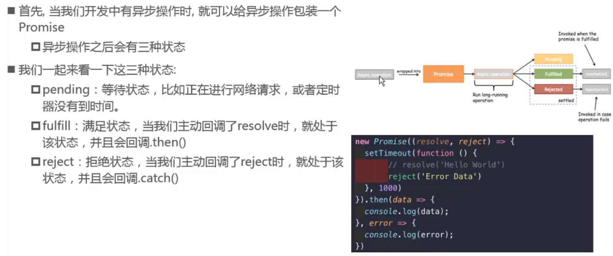
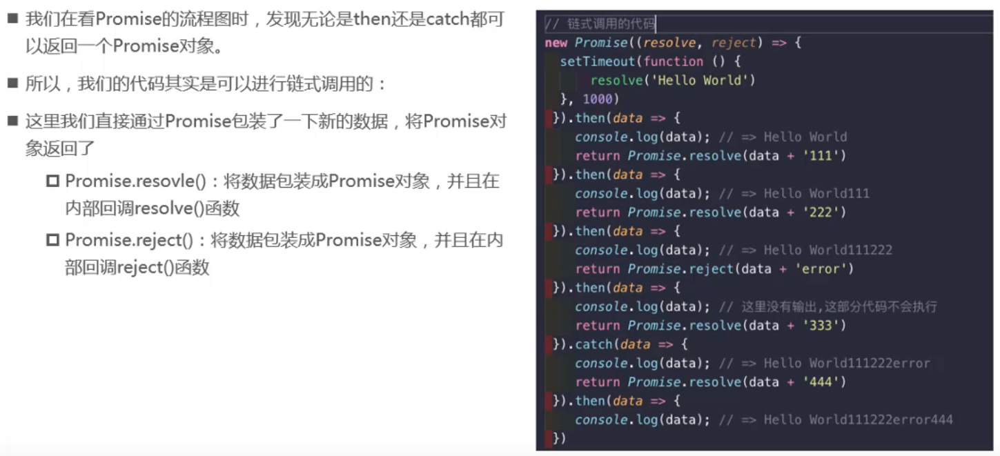
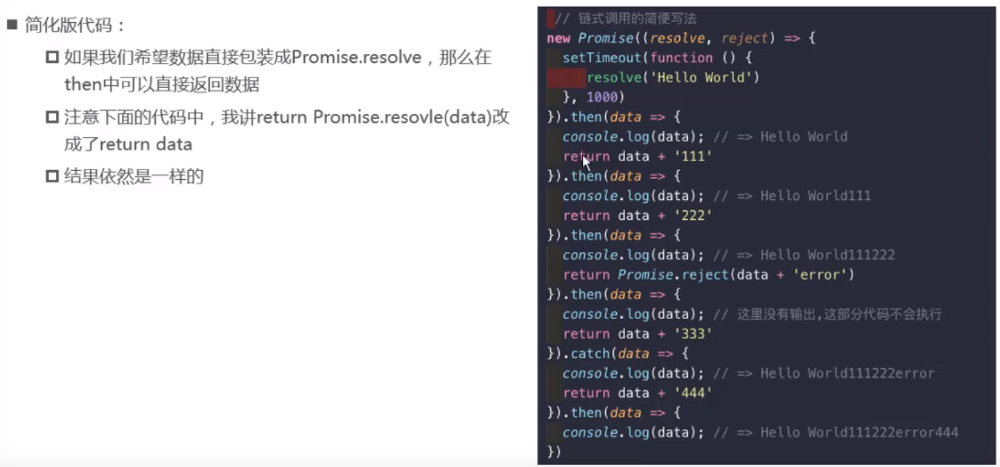

异步操作的4种情景

1. 回调
2. promise
3. generator
4. async await

Promise是异步编程的一种解决方案

使用`promise`解决回调地狱的问题

- promise 不能帮我们解决代码量
- 只是为了解决多层函数嵌套

## Promise 基本概念

1. 是一个构造函数，可通过 new Promise() 得到一个promise实例

2. Promise 上有两个函数，reseolve(成功的回调函数)，reject(失败的回调函数)

3. Promise 构造函数的 prototype 上有一个 .then方法，即 Promise 构造函数创建的实例，都可以访问 .then() 方法

4. Promise 表示一个 异步操作，每当 new 一个 Promise 实例时，就表示一个具体的异步操作

5. Promise 创建的实例是一个异步操作，而异步操作的结果，只有两种状态：

   - 异步执行成功，内部调用成功的回调 resolve，将结果返回
   - 异步执行失败，内部调用失败回调 reject，将结果返回

   由于 Promise 实例是异步操作，所以内部拿到操作结果后，无法使用 return 把操作的结果返回给调用者，只能通过回调函数的形式，来把成功或失败的结果，返回给调用者

6.  在 new 出来的 实例上，调用.then()方法，【预先】为这个 Promise 异步操作，指定 成功（resolve) 和 失败（reject）的回调函数；

> Promise特点：一旦创建就会被立即执行

```javascript
//实例出的只是一个形式上的异步操作，即只知道是个异步操作，而不清楚具体的异步事情。
var promise = new Promise()

//具体的异步操作，传入一个函数参数
var promise = new Promise(function(resolve,reject){
	//function 内部指定一个具体的异步操作！！
    //new 的时候，除了能得到一个 promise 实例，还会立即执行function中异步操作代码
  //函数内部调用resolve函数，则promise会执行.then这个函数
  resolve()
}).then(()=>{})

JS中只有function会按需执行，其他都会立即执行
function getFileByPath(){
	
}
```

## 什么时候使用promise

一般情况下是有异步操作时，使用promise对这个异步操作进行封装

## promise的三种状态



## promise链式调用



### 链式调用简写



## Promise.all

```javascript
Promise.all([
        //定时器来模拟网络请求
        new Promise((resolve, reject) => {
          setTimeout(() => {
            resolve({ name: 'why' })
          }, 2000)
        }),
        new Promise((resolve, reject) => {
          setTimeout(() => {
            resolve({ name: 'why22222' })
          }, 1000)
        })
      ]).then(results => {
        // 当上面两个请求都完成了，才会执行then
        // then中的results是一个数组，数组包含了以上两个请求的结果
        //results[0]  //第一个请求的结果
        //results[1]  //第二个请求的结果

        console.log(results)
      })
```

