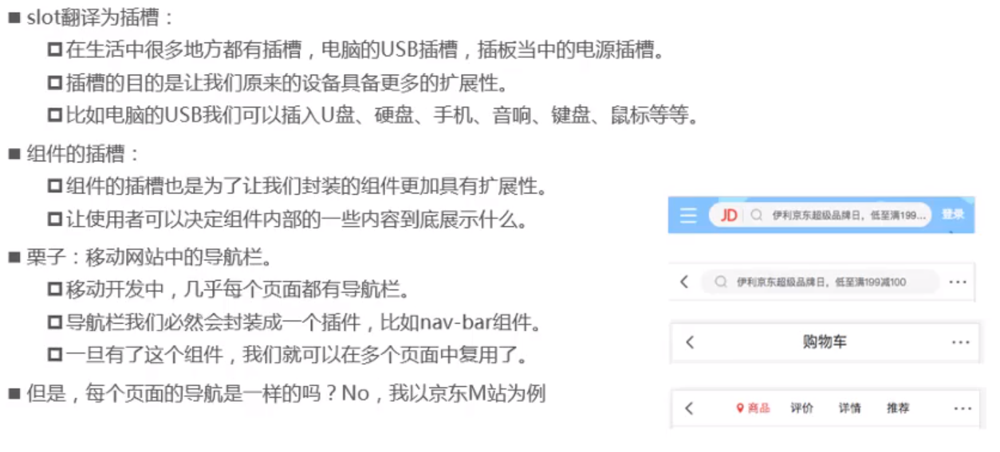
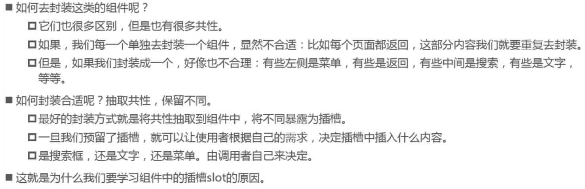
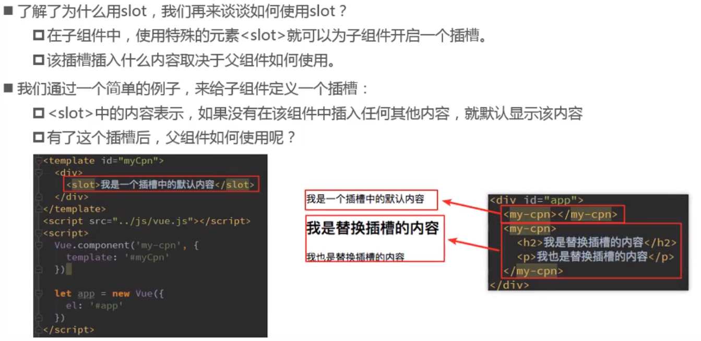
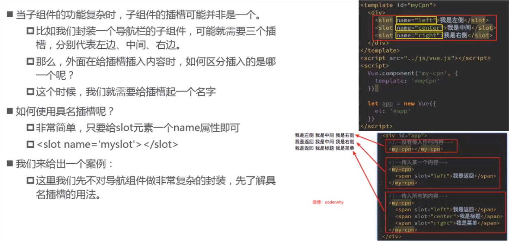
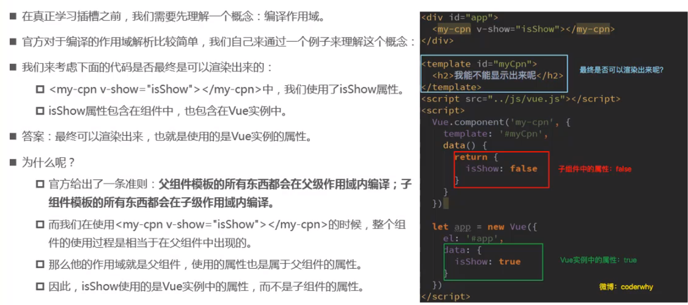
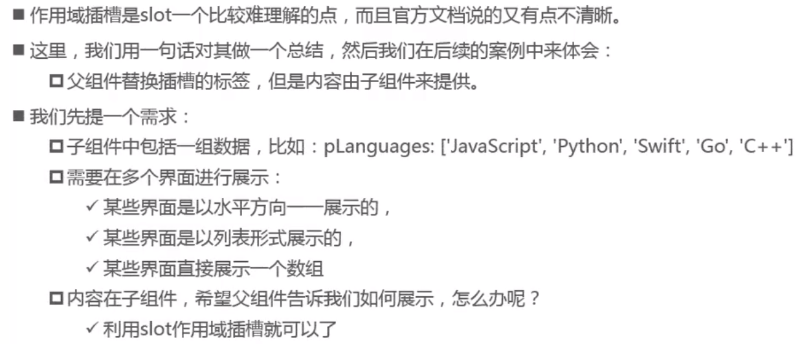

## 为什么使用slot

## slot基本使用

插槽的基本使用：<slot></slot>

插槽的默认值：`<slot><button></button></slot>`

如果有多个值，同时放入到组件进行替换时，一起作为替换的元素

## 具名插槽

> 给<slot>元素制定一个 name 后可以分发多个内容，具名 slot 可与 单个 slot 共存

## 编译作用域

> slot 分发的内容，作用域是在父组件上的

## 作用域插槽

> 使用场景：即可以复用子组件的 slot，又可以使 slot 内容不一致

