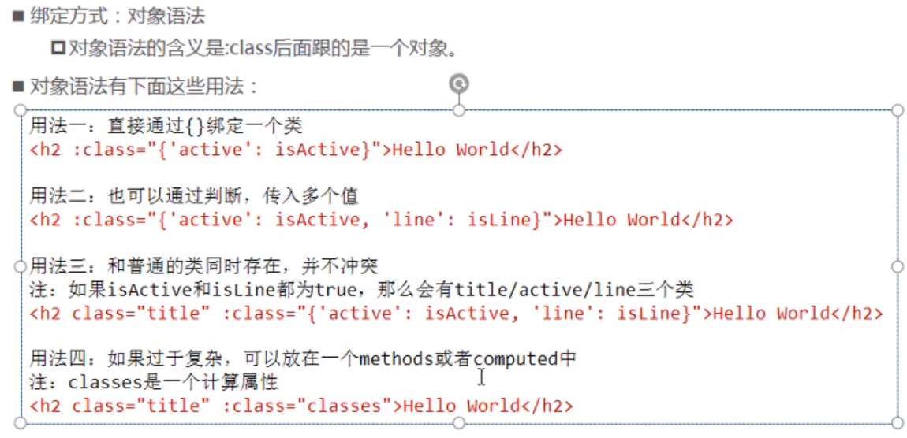
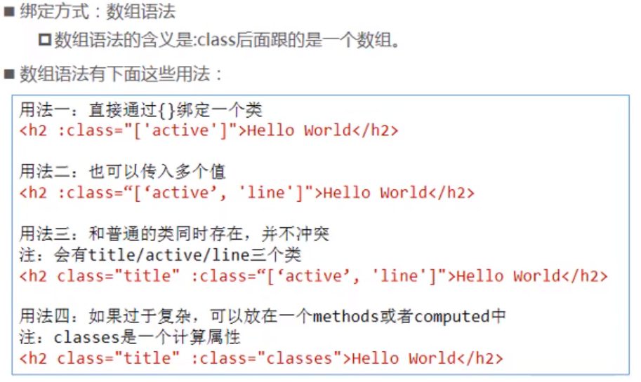

## 动态绑定class

### 对象语法



```javascript
// 类名active依赖于数据 isActive, 当其为 true 时， h2 会拥有类名 active
data: {
  isActive: true
}
```

```html
<!-- boolean为true时，该类就被添加到class上， -->
<!-- <h1 :class="{类名1：boolean, 类名2：boolean}"></h1> -->
<h1 :class="{red: isRed, italic: false}">动态绑定class对象语法</h1>
```

> :class 和普通 class 可以共存


### 数组语法



1. 数组

```
<h1 :class="['red', 'thin']">这是一个邪恶的H1</h1>
```

2. 数组中使用三元表达式

```
<h1 :class="['red', 'thin', isactive?'active':'']">这是一个邪恶的H1</h1>
```

3. 数组中嵌套对象

```
<h1 :class="['red', 'thin', {'active': isactive}]">这是一个邪恶的H1</h1>
```

4. 直接使用对象

```
<h1 :class="{red:true, italic:true, active:true, thin:true}">这是一个邪恶的H1</h1>
```

## 绑定style

1. 直接在元素上通过 `:style` 的形式，书写样式对象

```
<h1 :style="{color: 'red', 'font-size': '40px'}">这是一个善良的H1</h1>
```

- 属性名也可用驼峰法表示(驼峰不加引号)，如： 'font-size'  =>  fontSize
- 属性值一定要加单引号，否则vue会解析为一个变量

2. 将样式对象，定义到 `data` 中，并直接引用到 `:style` 中

- 在data上定义样式：

```
data: {
        h1StyleObj: { color: 'red', 'font-size': '40px', 'font-weight': '200' }
}
```

- 在元素中，通过属性绑定的形式，将样式对象应用到元素中：

```
<h1 :style="h1StyleObj">这是一个善良的H1</h1>
```

3. 在 `:style` 中通过数组，引用多个 `data` 上的样式对象

- 在data上定义样式：

```
data: {
        h1StyleObj: { color: 'red', 'font-size': '40px', 'font-weight': '200' },
        h1StyleObj2: { fontStyle: 'italic' }
}
```

- 在元素中，通过属性绑定的形式，将样式对象应用到元素中：

```
<h1 :style="[h1StyleObj, h1StyleObj2]">这是一个善良的H1</h1>
```

> :style 的数组语法并不常用，因为往往可以写在一个对象里面
>
> 

## 使用计算属性绑定class

```html
<div id="app">
	<button :class="bindClass"></button>
</div>
```

```javascript
var vm = new Vue({
      el: '#app',
      data: {
        size: 'large',
        disabled: true
      },
      computed: {
        /* 样式 btn 会始终应用， 当数据 size 不为空时，应用样式 btn-,后跟size的值；
        数据 disabled 为真时， 应用样式 btn-disabled
         */
        bindClass: function () {
          return [
            'btn',
            {
              ['btn-' + this.size]: this.size !== '',
              ['btn-disabled']: this.disabled
            }
          ]
        }
      },
    })
```

最终渲染结果

```html
<button class="btn btn-large btn-disabled"></button>
```

> 业务中经常使用计算属性给元素动态设置类名
>
> 如果表达式较长或逻辑复杂，应尽可能优先使用计算属性