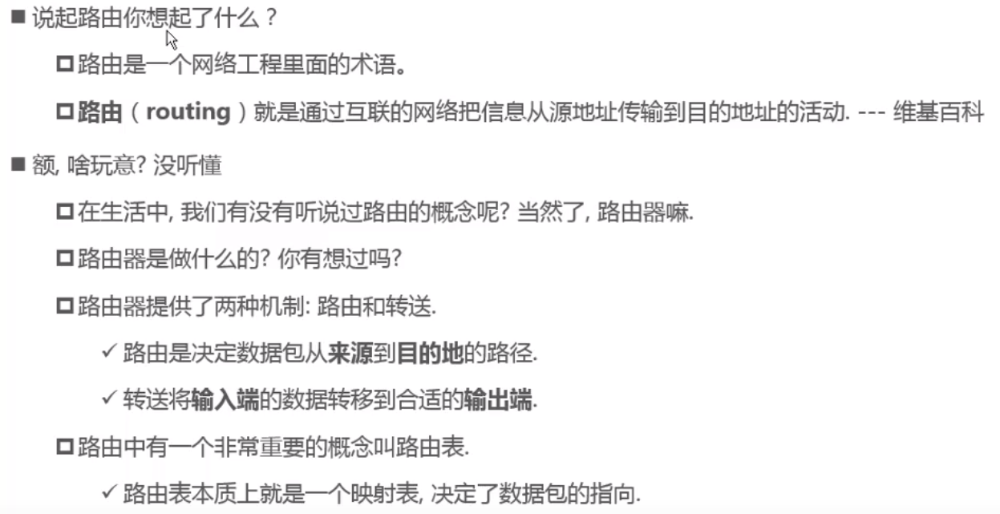
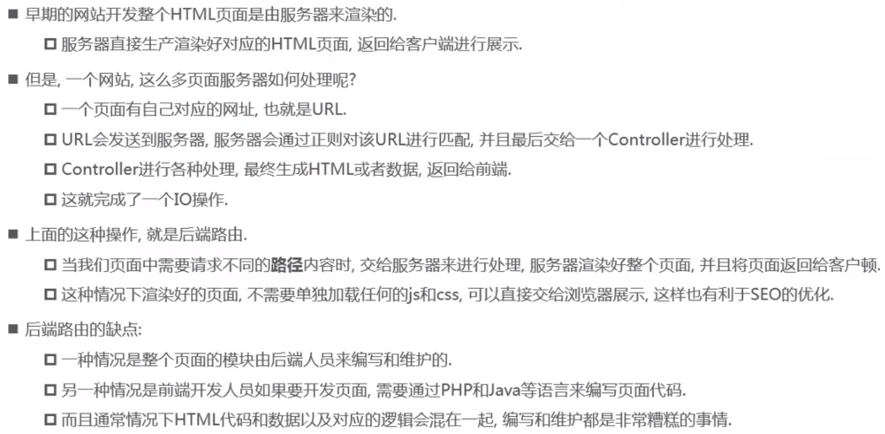
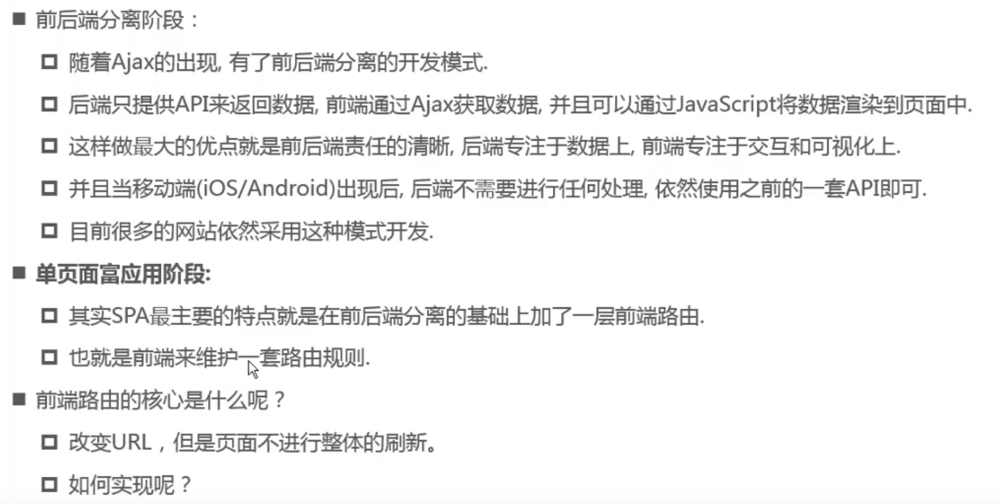
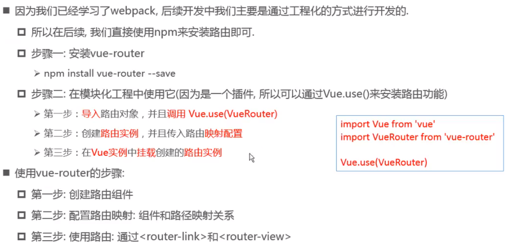
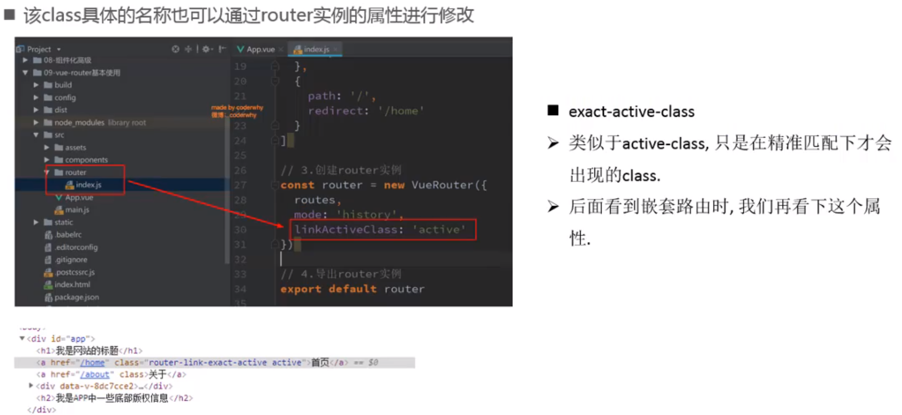
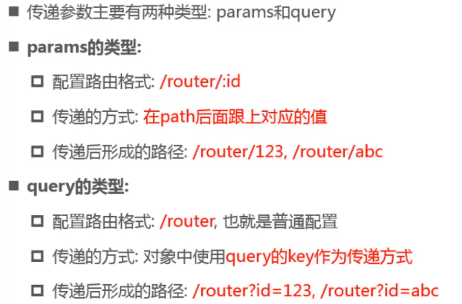
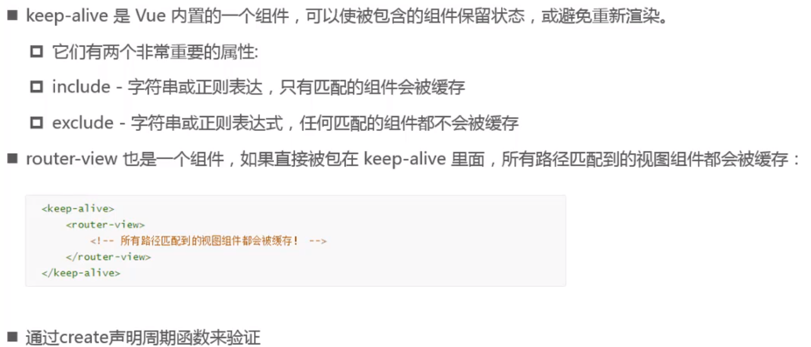

## 认识路由



### 后端路由阶段

后端处理URL和页面之间的逻辑关系



### 前端路由阶段

前后端分离：后端只负责提供数据，不负责任何阶段的内容



### 改变页面不刷新的方法

#### URL的hash

- URL的hash也就是锚点（#），本质上是改变window.location的href属性
- 可以通过直接赋值location.hash来改变href，但是页面不发生刷新

#### HTML5的history模式

```js
history.pushState({data}, 'title', 'url')
// 不能返回
history.pushState({data}, 'title', 'url')

history.back() == history.go(-1)
history.forward() == histroy.go(1)
//以上三个接口等同于浏览器界面的前进后退
```

## vue-router的基本使用



### 路由的默认路径

```js
{
    path: '/',	//或 ''
    redirect: '/路径'
}
```

### router-link


### linkActiveClass




## vue-router嵌套路由

## vue-router参数传递



## vue-router导航守卫

全局导航守卫

路由独享守卫

组件类守卫

## keep-alive

keep-alive 是 Vue 内置的一个组件，可以使被包含的组件保留状态，或避免重新渲染

router-view 也是一个组件，如果直接被包再 keep-alive 里面，所有路径匹配到的视图组件都会被缓存



