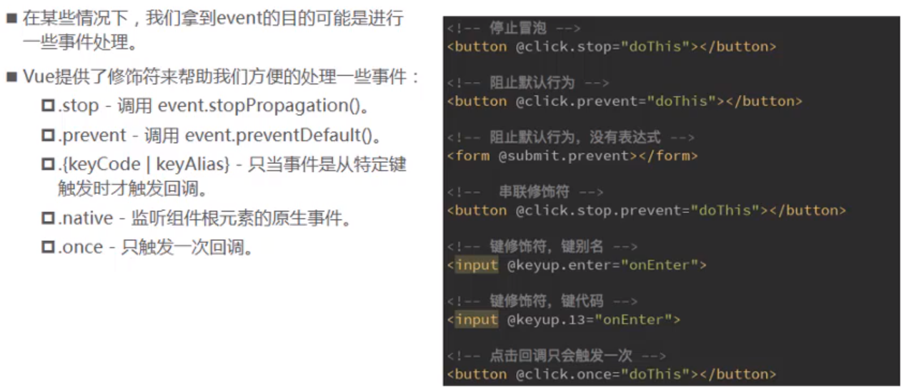
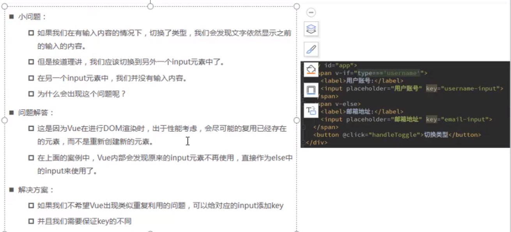
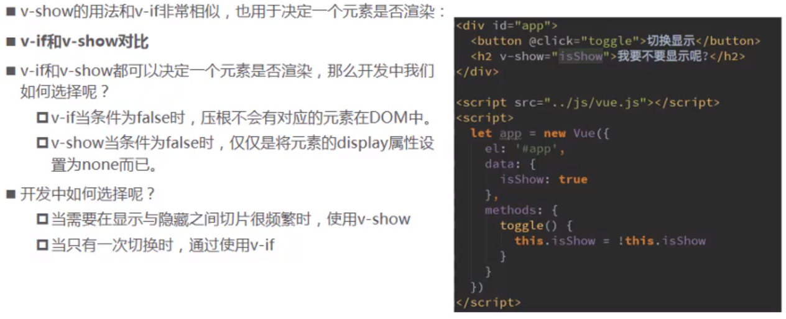
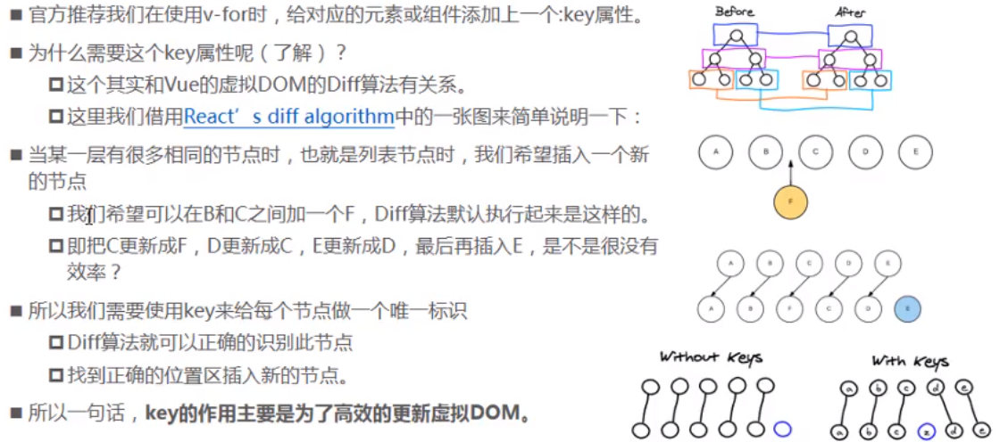
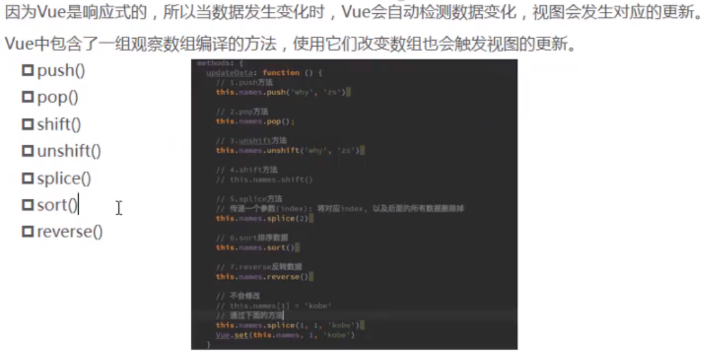
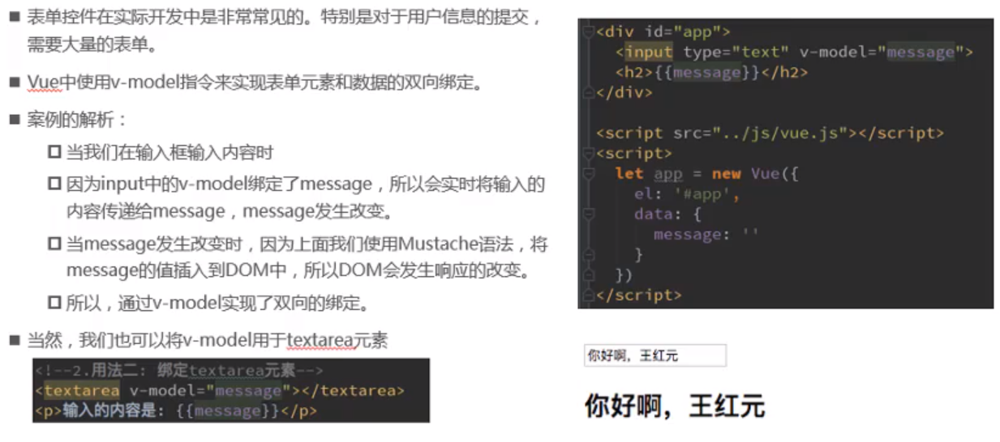
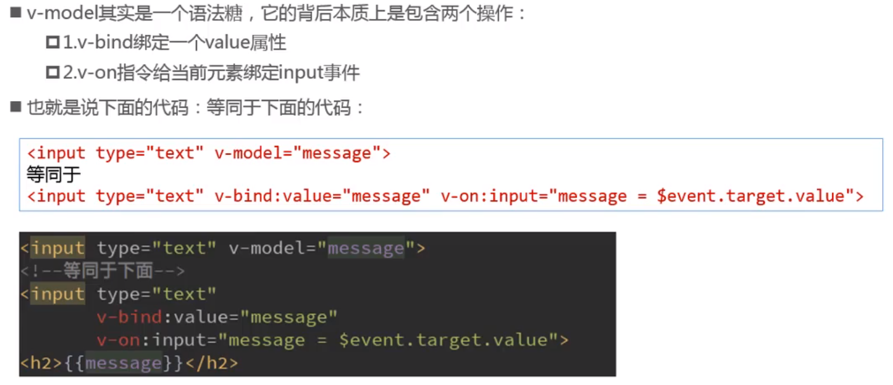
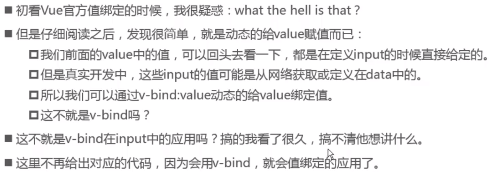
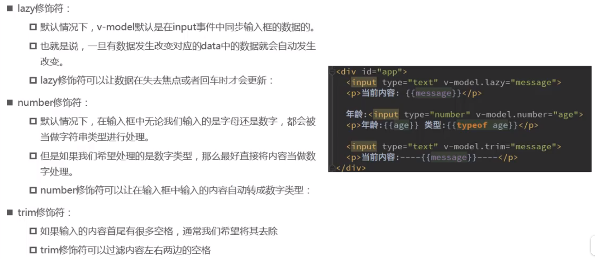

# v-cloak

> v-cloak 是一个解决初始化慢导致页面闪动的最佳实现，对于简单的项目很实用
>
> v-cloak能够解决差值表达式闪烁的问题（网速慢的时候）

> 工程化的项目不需要 v-cloak，因为其HTML结构只有一个空的div，剩余的内容都是由路由取挂载不同的组件完成的

# v-once

> 定义它的元素或组件只渲染一次，包括元素或组件的所有子节点
>
> 首次渲染后，不再岁数据的变化重新渲染，将被视为静态内容

# v-on 

## v-on参数问题

**1. 当方法不需要参数时，方法后的()可以不添加**

**2. 原生event参数**

在事件定义时，如果写方法时省略了小括号，但是方法本身是需要一个参数时，vue会默认将浏览器产生的event事件对象作为参数传入到方法

对比函数：如果函数需要参数，但是没有传入，那么函数的形参为 `undefined`

```html
<button @click="btn2Click"></button>
```

```javascript
methods:{
  btn2Click(event) {
    console.log(event)	//
  }
}
```

**3.方法定义时，同时需要event参数和其他参数**

传多个参数时（包含event），event需要用**$event**标识，否则vue会识别 event 为一变量

传入的参数为变量时，如`btn3Click(abc）`，不加' '，abc会被识别为变量，vue会从data中找

```html
<button @click="btn3Click(123, $event)"></button>
```

```javascript
methods:{
  btn3Click(abc,event) {
    console.log(abc,event)	//
  }
}
```

## v-on修饰符



**.stop**

```html
<div class="inner" @click="divClick">
  <input type="button" value="戳他" @click.stop="btnClick">
</div>
```

**.key**

```html
<!-- 监听某个键帽的点击,键盘的点击事件一般都用keyup -->
<!-- 只监听enter的点击 -->
<input type="text" @keyup.enter="keyup">

<!-- 只有在 keyCode 是13时调用 vm.submit -->
<input @keyup.13="submit">

```

# v-if

## v-if切换问题（VDOM的重复渲染）



# v-show



## v-if 的特点

1. 每次都会重新删除或创建元素 
2. v-if 有较高的切换性能消耗

## v-show 的特点

1. 每次不会重新进行DOM的删除和创建操作，只是切换了元素的 **display:none** 样式
2. v-show 有较高的初始渲染消耗 
3. v-show 不能在 <template> 上使用

## v-if 和 v-show的选择

v-if是真正的条件渲染

v-show 只是简单的 css 属性切换，无论条件真假，都会被编译

> 如果元素涉及到**频繁的切换**， 荐使用 v-show
>
> 如果元素可能永远也不会被显示出来被用户看到，则推荐使用 v-if (实际开发使用较多)

# v-for

## 遍历

> 支持用 of 代替 in

### 遍历对象

> 遍历对象属性时，有两个可选参数， 除了 有 key  ,在第三个位置还有 一个 索引 index

```html
<ul>
  <li v-for="(value,key,index) in info">值：{{value}}--键：{{key}}--索引：{{index}}</li>
</ul>
```

### 遍历数字

```html
<!-- 注意：如果使用 v-for 迭代数字的话，前面的 count 值从 1 开始 -->
<p v-for="count in 10">这是第 {{ count }} 次循环</p>
```

## key属性



v-for 循环的时候，key 属性只能使用 number获取string 

key 在使用的时候，必须使用 v-bind 属性绑定的形式，指定 key 的值 ，要保证key的唯一性，否则也没有意义

在组件中，使用v-for循环的时候，或者在一些特殊情况中，如果 v-for 有问题，必须 在使用 v-for 的同时，指定 唯一的 字符串/数字 类型 :key 值 

## 检测数组更新

> vue 的核心是 数据于视图的双向绑定



push和unshift都可以传递多个参数，用逗号隔开

通过索引修改数组中的元素不是响应式的，可以通过`Vue.set(要修改对象,索引值,修改后值)`方法

###### 可变参数

```javascript
// 可传入任意数量参数
function(...num) {
  
}
sum(10,20,30,40,50)
```

# v-model



## v-model原理



## 值绑定



## v-model修饰符

**v-model.lazy**

vue默认的绑定是实时的，`.lazy`会等回车或失焦时再绑定

v-mode默认会把绑定的数据都变为string类型

