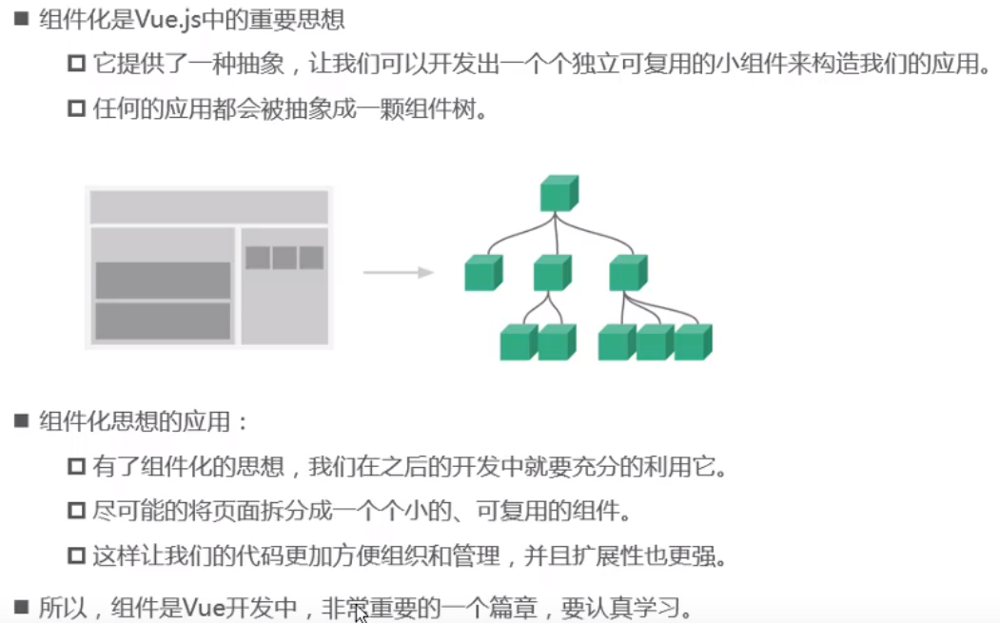
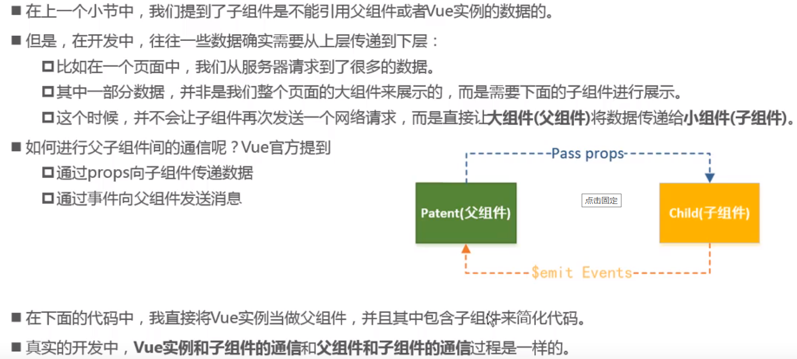
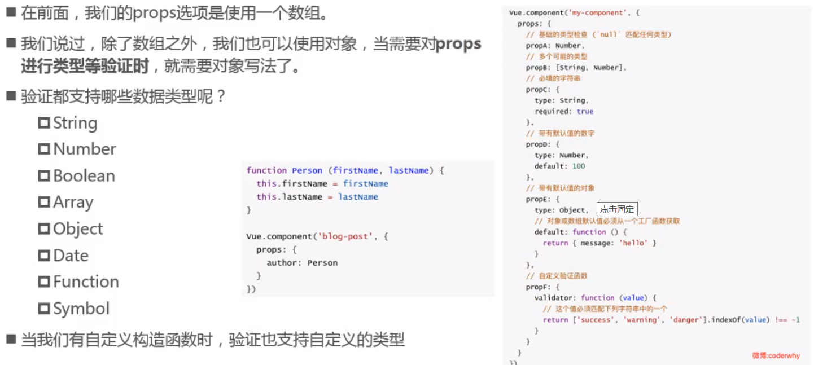
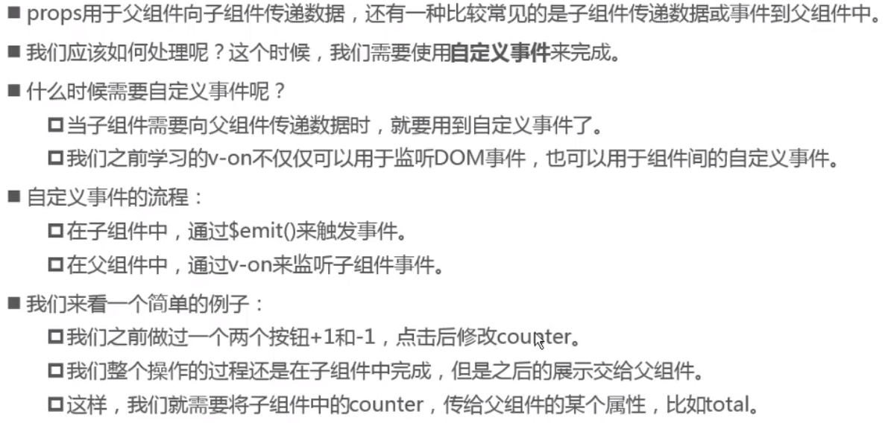
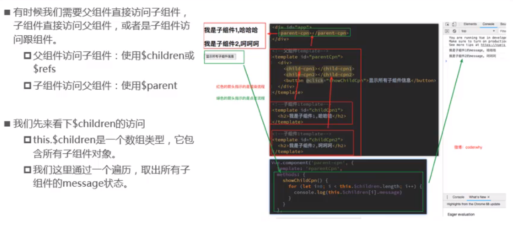

## vue组件化思想



## 定义Vue组件

什么是组件： 组件的出现，就是为了拆分Vue实例的代码量的，能够让我们以不同的组件，来划分不同的功能模块，将来我们需要什么样的功能，就可以去调用对应的组件即可；
组件化和模块化的不同：

- 模块化： 是从代码逻辑的角度进行划分的；方便代码分层开发，保证每个功能模块的职能单一；
- 组件化： 是从UI界面的角度进行划分的；前端的组件化，方便UI组件的重用；

### 全局组件定义的三种方式

1. **使用 Vue.extend 配合 Vue.component 方法创建全局的Vue组件**

```javascript
//1.1创建组件构造器：通过template属性指定组件要展示的HTML结构
var login= Vue.extend({  
      template: '<h1>登录</h1>'	
})
//1.2注册组件：使用使用 Vue.component ('注册组件的标签名'，组建构造器)
    Vue.component('myLogin', login);
```

​	1.2使用组件

​	直接把组件的名字，以HTML标签的形式引入到页面中

```html
<!--驼峰命名法的组件需要用-的形式作为HTML标签-->
<my-login></my-login>
```

2. **直接使用 Vue.component ('组件的名称'，创建出来的组件模板对象)方法**

```
Vue.component('register', {
      template: '<h1>注册</h1>'
});
```

3. **将模板字符串分离，定义到外部**

```html
<template id="tmpl">
  <div>
    <h1>通过template在外部定义组件结构</h1>
  </div>
</template>
<!--或者-->
<script id="tmpl" type="x-template">
	<div><a href="#">登录</a> | <a href="#">注册</a></div>
</script>
```

同时，需要使用 Vue.component 来定义组件：

```
Vue.component('account', {
      template: '#tmpl'
});
```

> 注意：template属性指向的模板内容，即 组件中的DOM结构，有且只能有唯一的根元素（Root Element）来进行包裹！

### `components`属性定义局部子组件

```html
<div id="app">
	<login></login>
</div>
<template id="tmp">
  <h1>这是私有的 login 组件</h1>
</template>
```

```javascript
var vm2 = new Vue({
  el: '#app2',
  components: { // 定义实例内部私有组件的
	login: {
      template: '#tmpl2',
      components: {
        login-son: { // login的子组件login-son
          template: "<h3>子组件的子组件</h3>"
		}
	  }
	}
  },
})
```


## 组件中data和methods

1. 在组件中，`data`需要被定义为一个**方法**，例如：
   - 组件可以有自己的data数据
   - 实例中的data可以是一个对象，但**组件中的data必须是一个方法**
   - 组件中的data方法，**必须返回一个对象**

```
Vue.component('account', {
	template: '<h1>全局组件，{{msg}}</h1>',
	data() {
		return {
			msg: '组件中data定义的数据'
		}
	},
	methods:{
		login(){
			alert('点击了登录按钮');
		}
	}
})
```

2. 在子组件中，如果将模板字符串，定义到了script标签中，那么，要访问子组件身上的`data`属性中的值，需要使用`this`来访问；

## 父子组件通信



### 父传子props

> 1. 子组件通过声明 props 属性 来接收父组件传递来的数据
> 2. 父组件通过在 子组件标签上绑定属性来传值
>    - 属性名 为 子组件在 props 上定义的名称
>    - 属性值 为 父组件 data 上要传递的值名

- props值分为两种，**字符串数组**，**对象**
- props 中的数据，都是只读的，无法重新赋值

> props 中声明的数据与组件 data 函数 return 的数据主要区别就是：props 来自父级，data 中的是组件自己的数据，作用域是组件本身
>
> - 两种数据都可在 template、computed、methods中使用

```html
<div id="app">
  <!--v-bind绑定的属性必须是小写或驼峰标识-->
	<child v-bind:parentmsg="msg" :parenttitle='tit'></child>
</div>

<template id="child">
	<div>
		<p>父组件msg: {{parentmsg}}</p>
		<p>父组件tit: {{parenttitle}}</p>
	</div>
</template>
```

#### 单向数据流

vue.2x中 通过 props 传递数据是单向的，即父组件数据变化时会传递给子组件，反过来不行。

> js 中对象和数组是引用类型，指向同一个内存空间，所以 props 是对象和数组是，在子组件内改变是会影响父组件的

#### props数据验证



```javascript
// 子组件
const child = {
	template: '#child',
  //数组中存的时字符串形式的变量
	props: ['parentmsg','parenttitle'],
  //对象的写法
  props: {
    //1. 可对传入的数据类型验证
    parentmsg: String,
    // 碧玺是字符串或数字类型
    parentmsg: [String, Number]
    //2. 提供默认值（未传值的情况）
    parenttitle: {
    	type: String,
    	default: '默认值',
    	required: boolean
  	},
  	array: {
      type: Array,
      //类型为对象或者数组时，默认值必须是一个函数
      default: function(){
        return []
      }
    },
  	//自定义验证
  	msg: {
      validator: function(value) {
        return value > 10
      }
    }
  }
  data(){
    return { }
  }
}
// 根组件
var vm = new Vue({
	el: '#app',
	data: {
		msg: '来自父组件中的数据',
		tit: '来自父组件的标题'
	},
  methods: {},
	components: {
		child,
	}
})
```

### 子传父$emit

#### 自定义事件

> 用于子组件向父组件传递数据



1. 子组件通过$emit（）触发

```javascript
methods: {
  sonClick(sonData) {
    this.$emit('sonMethod',sonData)
  }
}
```

2. 父组件在子组件定义方法接收

```html
<son-com @sonMethod="pMethod"></son-com>
```

```javascript
methods: {
  pMethod(data) {
    // 打印子组件传递来的 data
    console.log(data)
  }
}
```

#### 监听DOM事件

> .native 修饰符表示监听的是一个原生事件，监听的是该组件的根元素

```html
<son-com @click.native="pMethod"></son-com>
```


### 组件间访问



#### 父链：父访问子

this.$children

this.$refs

```html
<div id="app">
  <input type="button" value="获取元素" @click="btnClick" ref="mybtn">
	<login ref="mylogin"></login>
</div>

<template id="child">
	<div>我是子组件</div>
</template>
```

```javascript
 //$refs => 默认是一个空的对象，只有指定子组件的ref值时，refs才有内容
```

> $refs 只在组件渲染完成后才填充，且是非响应式的
>
> 应避免在模板或计算属性中使用 $refs

#### 子访问父

this.$parent

开发中一般不建议使用

> 应尽可能避免依赖 父组件 的数据，更不应主动修改它的数据，这样会使得父子组件紧耦合
>
> 理想情况下，只有组件自己能修改它的状态
>
> 父子组件通信最好通过 props 和 $emit

#### 访问根组件（vue实例）

this.$root

一般用不到，因为vue实例中基本不放任何数据，只有些路由或vuex