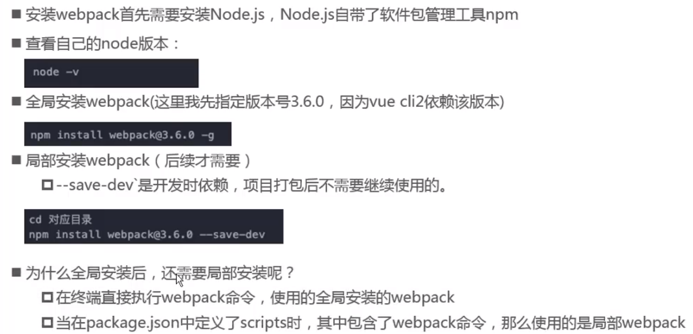
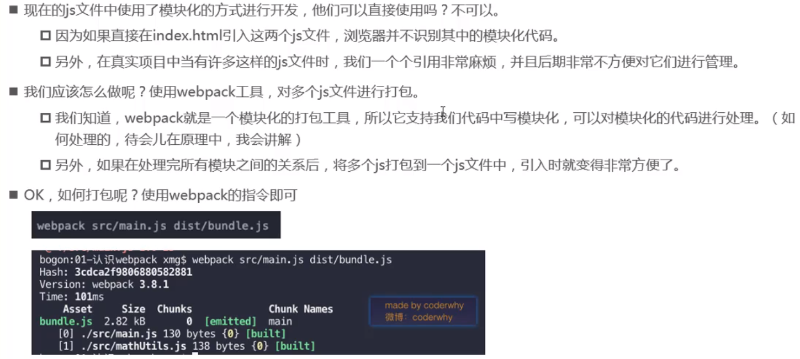

模块化开发的代码浏览器是不认识的，需要用 webpack 打包
webpack 会自动处理模块之间的依赖

# webpack安装



## webpack安装
1. 初始化package.json文件：

```shell
npm init -y
```

2. 安装webpack(开发阶段依赖，-D(--save-dev)表示上线后不需要这个包)

```shell
npm i webpack@3.6.0 -D
```

**注意**：webpack4之后的版本需要安装webpack-cli

```shell
npm i webpack-cli -D
```

## js文件的打包



打包后会在dist文件下，生成一个bundle.js文件

- bundle.js文件，是webpack处理乐项目直接文件依赖后产生的一个js文件，我们只需引用 webpack 打包后的 JS 文件在index.html中即可

### 全局 webpack 打包命令

`webpack ./src/main.js ./dist/bundle.js`

# webpack 配置

## 配置打包文件路径

1. 创建配置文件： webpack.config.js(默认配置文件名)
   配置完 entry 和 output 后就可以直接使用 `webpack` 命令打包

```javascript
//该配置文件，就是一个JS文件，通过NODE的模块操作，向外暴露一个配置对象
module.exports = {
    //手动指定入口和出口文件
  	//入口：表示要使用webpack打包哪个文件
    entry: path.join(__dirname,'./src/main.js'),
  	//输出配置文件,指定打包好的文件，输出到哪个目中去
    output:{    
        //__dirname:node上下文全局变量，保存当前文件所在的路径
        //resolve: 将当前文件路径和指定文件拼成绝对路径  
        path: path.resolve(__dirname, 'dist'),
        //path: path.join(__dirname,'./dist'),
        filename: 'bundle.js'   //指定输出的文件名称 
    },   
}
```

### 将 webpack 命令映射为 npm run build

package.json 中 scripts 脚本添加
`"build": "webpack"`
此时会优先使用本地的（局部的）webpack，没有再去找全局的 webpack
注：终端中的 webpack 命令都是全局的

本地安装的 webpack 才会和项目保持同步（clone 下的项目有自己使用的 webpack 版本，而如果用全局的 webpack 打包命令，可能会因为和项目 webpack 版本的不一致而造成打包错误），所以一般不使用全局 webpack

### 开发时依赖(devDependencies)

如使用 webpack 时

### 运行时依赖(dependencies)

使用 vue

### 文件夹的处理

入口文件放在最外面，功能相关的放到对应的文件夹内

---

# loader 的使用

将静态资源都当作模块来使用

## css 文件处理
`
## less 文件处理

`npm install --save-dev less-loader less`

## 图片的处理

`npm install --save-dev url-loader`

//涉及到 url 的文件让其自动添加一个路径
publicPath: 'dist/'

## ES6 语法处理

安装
`npm i -D babel-loader@7 babel-core babel-preset-es2015`
官网安装的是 babel-reset-env, 需要一个配置文件对其配置
配置

```javascript
{
  test: /\.js$/,
  // 排除nodemodules中的JS文件
  exclude: /(node_modules|bower_components)/,
  use: {
    loader: 'babel-loader',
    options: {
      presets: ['es2015'] //es2015不需要额外babel配置文件
    }
  }
}

```

---

# 在 webpack 中使用 vue

### 安装

`npm i vue -S`

vue 在构建最终的发布版本时有两种

1. runtime-only

- 代码中不能有任何的 template

2. runtime-compiler

- 代码中可以有 template, 因为有部分 compiler 代码可以用于编译 template

### 解决方案

方式 1：webpack 中配置

```javascript
resolve: {
  // 别名
  alias: {
    'vue$': 'vue/dist/vue.esm.js'
  }
}
```

el 和 template 同时存在时，定义的 template 模板内容会替换掉 el 挂载的#app 内容

将 template 抽离成组件的形式
```javascript
const App = {
  template: `
  <h2>定义的template模板会替换掉el挂载的#app</h2>
  `,
  data() {
    return {
      message: 'hello webpack'
    }
  }
}
new Vue({
  el: '#app',
  template: '<App/>',
  components: {
    App
  }
})
```
进一步抽离成组件导入的形式
> 因为App是一个对象，所以可以直接定义一个app.js文件通过export default {}的方式导出
在main.js中通过import App from '路径' 的形式导入该组件（default导入的方式，App不需要{}包裹）

通过.vue文件将template抽离, 但webpack此时并不识别.vue类型的文件，需要安装对应的loader:
 `npm i vue-loader vue-template-compiler -D`
vue-loader: 加载.vue文件
vue-temlate-complier: 解析.vue文件，将template解析成render函数
**注意** 
vue-loder@14之后的版本需要对应的插件

修改webpack的loader配置
```javascript
{
  test: /\.vue$/,
  use: ['vue-loader']
}

```
---
# plugin插件的使用
## 添加版权的plugin
BannerPlugin webpack内置插件
```javascript
const webpack = require('webpack')
module.exports = {
  plugins: [
    new webpack.BannerPlugin('最终版权归*风度万人迷*所有')
  ]
}
```
## 打包html的插件
`npm i html-webpack-plugin -D`
```javascript
// 使用
const HtmlWebpackPlugin = require('html-webpack-plugin')
module.exports = {
  plugins: [
    new HtmlWebpackPlugin({
      template: 'index.html'
    })
  ]
}
```
需要解决的两个问题，
1. url dist目录配置取消
2. 自动生成一个<div #app></div>的根容器
   plugin传入参数，根据指定的模板去生成html文件
   
## js压缩的plugin
**注意：**开发的时候不建议使用，不方便调试（打包时的插件）
对打包的js文件进行压缩，指定版本号1.1.1，和cli2保持一致
会和BannerPlugin冲突
`npm i uglifyjs-webpack-plugin@1.1.1 -D`
```javascript
// 使用
const uglifyJsPlugin = require('uglifyjs-webpack-plugin')
module.exports = {
  plugins: [
    new uglifyJsPlugin()
  ]
}
```
## 本地服务的搭建
`npm i webpack-dev-server@2.9.3 -D`   指定版本和webpack3.6.0以及cli2配合
```javascript
// 修改webpack.config.js
devServer: {
    //要服务的文件夹
    contentBase: './dist',
    //是否实时监听
    inline: true,
  }
// 添加scripts配置启动命令
"dev": "webpack-dev-server --hot"
启动：webpack-dev-server
```
## 配置文件分离的而插件
webpack.config.js文件的抽离
分成开发时需要的配置，以及生成(打包)时需要的配置,
安装合并的插件
`npm i webpack-merge -D`
scripts脚本指定配置文件
```json
"build": "webpack --config ./build/prod.config.js",
"dev": "webpack-dev-server --open --config ./build/dev.config.js"
```
**注意：** 要修改base.config.js中文件的entry和output路径为 ../ 而不是 ./


