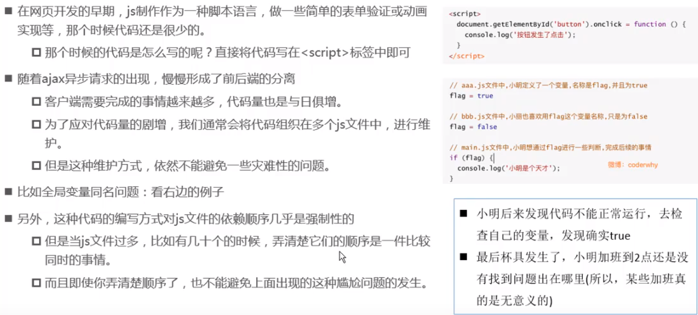
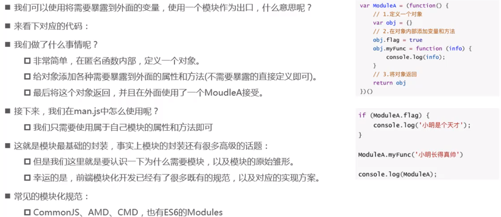
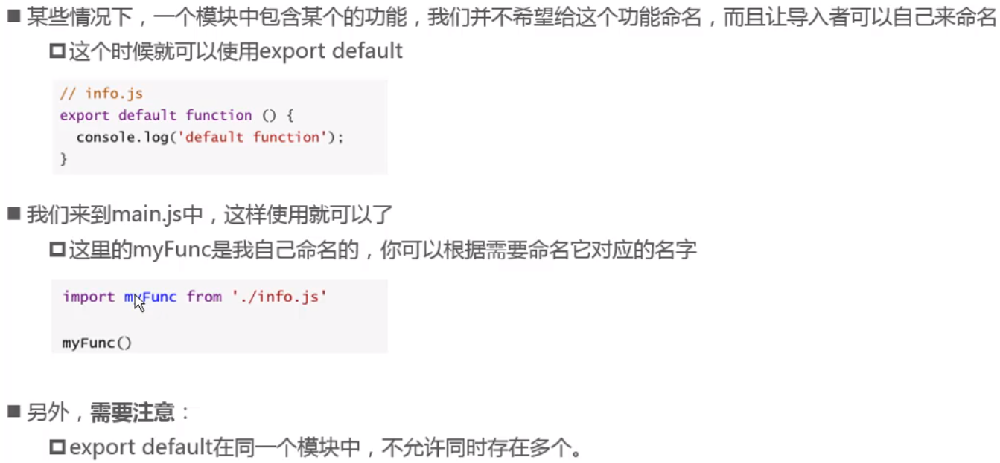
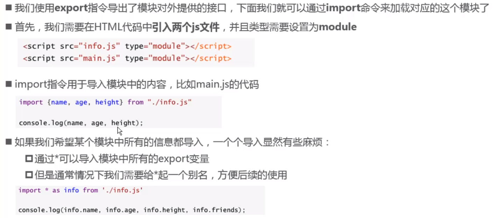
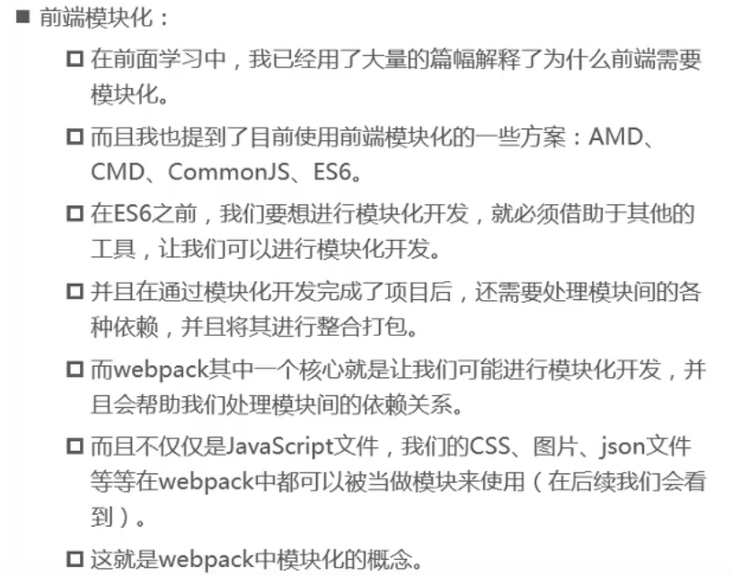
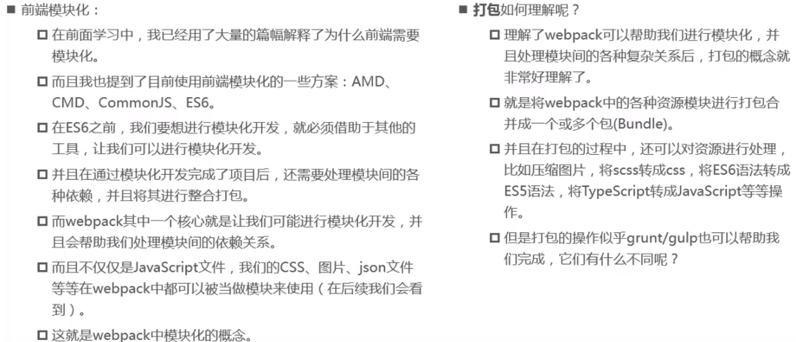
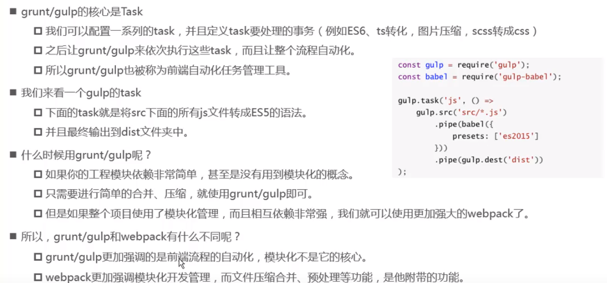

## 前端代码复杂带来的问题

### JS原始功能



### 模块化基本封装



#### common.js(了解)

#### export基本使用

> 导出的是什么名字，导入时需要用相同的名字

```javascript
//导出单个
export const name = 'wanko'
export const age = 18
export const height = '1.77'
```

```javascript
//导出对象
const name = 'wanko'
const age = 18
const height = '1.77'

export {name, age, height}
```

```javascript
//导出函数
export funciton foo(){
  
}
//导出类
export class Person {
  
}
//导入函数和类
import {foo, Person} from ''

```

#### export default



#### import使用



## 前端模块化



### 模块化和打包



### 和grunt/gulp对比

